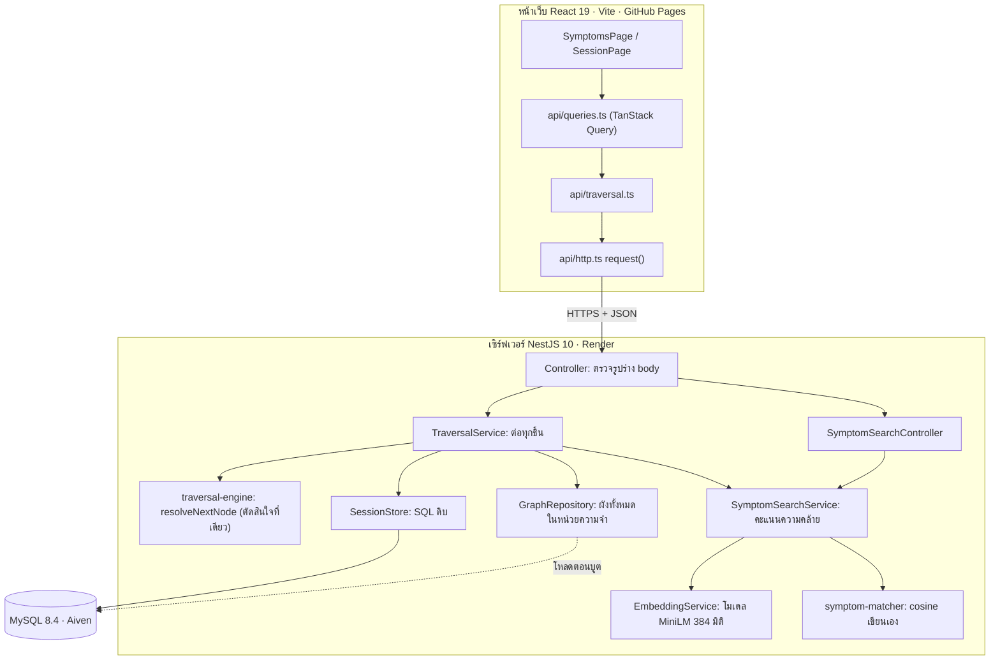
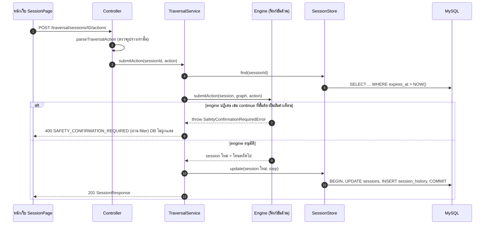

# ROADMAP — อ่านและพิมพ์โค้ด FixStep ด้วยมือตัวเอง

> สร้างเมื่อ 6 ต.ค. 2569 เพื่อเตรียมสอบปลาย ต.ค. 2569 · อ้างอิงโค้ดที่ commit `544004e` บน `main`
> ตอนสร้างเอกสาร: backend **183/183** เทสผ่าน · frontend **84/84** เทสผ่าน · `git status` สะอาด (ผมรันเทสแบบอ่านอย่างเดียว ไม่แก้ไฟล์ใดๆ)
> ถ้าเอกสารใน `docs/explained/` ขัดกับโค้ด **ยึดโค้ด** — รายการที่ขัดกันอยู่ที่ภาคผนวก ก

**เป้าหมาย:** พิมพ์โค้ดเดิมทีละไฟล์ด้วยมือจนอธิบายได้ทุกบรรทัด ต้นฉบับห้ามแก้ ห้ามลบ ห้าม commit/push จากโฟลเดอร์นี้

สารบัญ: [0 ข้อตกลง](#0-ก่อนเริ่ม-ข้อตกลง-วงจรต่อไฟล์-และสิ่งที่ต้องยืนยัน) · [1 ระบบทำงานอย่างไร](#1-ระบบทำงานอย่างไร) · [2 ทำไมออกแบบแบบนี้](#2-ทำไมออกแบบแบบนี้-และถ้าอาจารย์ถามให้ตอบอย่างไร) · [3 ลำดับและเวลา](#3-ลำดับอ่านและพิมพ์-ตามการพึ่งพากัน) · [4 คู่มือรายไฟล์](#4-คู่มือรายไฟล์) · [5 ไม่ต้องพิมพ์](#5-ไฟล์ที่ไม่ต้องพิมพ์) · [ภาคผนวก](#ภาคผนวก-ก-ที่เอกสารกับโค้ดไม่ตรงกัน)

---

## 0. ก่อนเริ่ม: ข้อตกลง วงจรต่อไฟล์ และสิ่งที่ต้องยืนยัน

### 0.1 ข้อตกลง

1. **ต้นฉบับอ่านอย่างเดียว** คัดลอกออกไปได้ แต่ห้ามแก้ ห้ามลบ ห้าม commit ห้าม push
2. ทำงานใน **โฟลเดอร์ทำงานใหม่** (ในเอกสารนี้เรียก `<WORK>`) ที่โครงสร้างเหมือนต้นฉบับ คือ `<WORK>/backend`, `<WORK>/frontend`, `<WORK>/data` ห้ามย้ายตำแหน่ง เพราะมี path ข้ามโฟลเดอร์ที่เทสและโค้ดพึ่งอยู่
   - เทส backend อ่าน `../../../data/manuals/samsung_ac_ar70h.json`
   - frontend import `../../../backend/src/traversal-engine/types` และ `../../../data/...`
3. **พิมพ์เอง ไม่ copy-paste** อ่านต้นฉบับทีละบล็อก (ฟังก์ชัน / interface) แล้วพิมพ์ตามในโฟลเดอร์ทำงาน
4. ทำทีละไฟล์ตามเลขลำดับใน §3 **หยุดรอ "ok" ก่อนไฟล์ถัดไป** (เมื่อให้ Claude ช่วย)
5. config ของโปรเจกต์ **ตั้งต้นเองในเฟส 0** (ดูต้นฉบับเพื่อเทียบ) ส่วนไฟล์ที่ไม่พิมพ์ (ข้อมูล หน้าตา เทส) **คัดลอกจากต้นฉบับเข้ามา** ตามจุดที่ระบุ เพื่อให้ `tsc` ผ่านทุกขั้น

### 0.2 วงจรต่อ 1 ไฟล์ (ใช้ซ้ำทุกไฟล์)

1. อ่านคำอธิบายไฟล์นั้นใน §4 (หรือให้ Claude อธิบายก่อนพิมพ์: ทำอะไร ทำไม ส่วนสำคัญ)
2. พิมพ์ไฟล์
3. ตรวจ: คอมไพล์ (`tsc`) แล้วรันเทสที่ระบุในรายการ
4. ตอบคำถาม 2–3 ข้อโดยไม่ดูโค้ด ถ้าตอบไม่ได้ให้ย้อนอ่านแล้วถามใหม่
5. เทียบกับต้นฉบับ: ส่วนที่ต่าง (นอกจากคอมเมนต์และช่องว่าง) ต้องอธิบายได้ว่าต่างแล้วพฤติกรรมเปลี่ยนอย่างไร (Claude ช่วยเทียบแบบไม่สนคอมเมนต์ได้)
6. ติ๊ก `[x]` แล้วจดเวลาจริงใน **ภาคผนวก ข**

### 0.3 เรื่องคอมเมนต์ในโค้ด

ค่าตั้งต้นของเอกสารนี้: **พิมพ์เฉพาะโค้ด** คอมเมนต์ภาษาไทยในต้นฉบับ **อ่านทุกบรรทัด แต่ไม่ต้องพิมพ์** เพราะหลายบรรทัดคือเหตุผลการออกแบบที่อาจารย์อาจถาม ชั่วโมงทั้งหมดใน §3 นับเฉพาะบรรทัดโค้ด ถ้าอยากพิมพ์คอมเมนต์ด้วย ไฟล์ MUST มีคอมเมนต์ 1,470 บรรทัด เพิ่มราว **7 ชม.** (ประมาณ 200 บรรทัด/ชม.)

### 0.4 สิ่งที่ผมสมมติ (ช่วยยืนยันหรือแก้)

| # | สมมติฐาน | ถ้าไม่จริง |
|---|---|---|
| ส1 | พิมพ์เฉพาะโค้ด ไม่พิมพ์คอมเมนต์ (§0.3) — ✅ **ยืนยันแล้ว 6 ต.ค.** (อ่านคอมเมนต์ทุกบรรทัดเอง) | บวกเวลาตาม §0.3 |
| ส2 | ~~วันสอบ 27 ต.ค.~~ → ✅ **วันสอบจริง 18 ต.ค. 2569** (ยืนยันแล้ว) นับวันเรียน 11 วัน (7–17 ต.ค.) ดูตารางที่ยืนยันแล้วใน **§3.4** | — |
| ส3 | ตอนรัน backend ในโฟลเดอร์ทำงาน ใช้ **MySQL ในเครื่องหรือฐานข้อมูลทดลองแยก** ไม่ชี้ไป Aiven ตัวจริง (migrate / seed / session ทดลองจะไปปนกับของจริง) — ✅ **ยืนยันแล้ว** (ผู้ใช้ตั้งฐานข้อมูลฝึกเอง) | — |
| ส4 | ไฟล์ที่ไม่ต้องพิมพ์ คัดลอกจากต้นฉบับเข้า `<WORK>` ได้ | ต้องหาวิธีอื่นให้ build ผ่าน |
| ส5 | อัตราการพิมพ์ (บรรทัดโค้ด/ชม. ตามชนิดไฟล์) เป็นค่าสมมติของผม ไม่ได้วัดจากคุณ | ปรับตามข้อ §3.3 "ปรับตัวคูณ" หลังจบไฟล์ที่ 01–02 |
| ส6 | ~~ไม่ทราบว่าวันละกี่ชั่วโมง~~ → ✅ **วันละ 6 ชม.** (ยืนยันแล้ว) | ดู §3.4 |
| ส7 | **(6 ต.ค.)** เริ่มด้วยแผน B · เฟส 8 **ยังไม่เลือกทาง** ตัดสินหลังจุดเห็นผลที่ 2 และจะคุยอีกรอบเรื่องการสลับ deploy เป็นโค้ดที่พิมพ์เองก่อนวันสอบ (ตอนนี้ยังไม่ deploy ทับของจริง) · ปักเวอร์ชันแพ็กเกจให้ตรงต้นฉบับ · Claude เขียนสคริปต์ทิ้งของจุดเห็นผลที่ 1 | ดู §3.4 |

---

## 1. ระบบทำงานอย่างไร

### 1.1 คำศัพท์ (ตรงกับที่ใช้ในโค้ด)

| คำ | ความหมาย |
|---|---|
| ผัง / graph / `graphId` | ขั้นตอนวินิจฉัย 1 อาการ เช่น "แอร์ไม่ทำงาน เปิดไม่ติด" = เครื่องสถานะ 1 ชุด |
| โหนด / node / สถานะ | 1 ขั้นในผัง มี 5 ชนิด: `checkpoint` (คำถามใช่/ไม่ใช่) · `instruction` (บอกให้ทำ) · `input` (ให้กรอกค่า) · `resolution` (จบ: แก้ได้/ปกติ) · `escalation` (จบ: ส่งต่อช่าง) |
| action | สิ่งที่ผู้ใช้ส่ง มี 4 แบบ: `answer` (yes/no) · `continue` · `confirm_safety` · `input` (ค่าที่กรอก) |
| session | การตรวจ 1 ครั้ง จำว่าอยู่โหนดไหน ตอบอะไรมาแล้ว |
| engine | `backend/src/traversal-engine/` ฟังก์ชันล้วนที่ตัดสินว่าขั้นถัดไปคืออะไร |
| safety gate | โหนด `instruction` ที่ `safety_critical` ต้องส่ง `confirm_safety` เท่านั้น |

### 1.2 เรื่องเล่า: จากพิมพ์อาการ จนจบการตรวจ

สมมติผู้ใช้แอร์ Samsung เปิดไม่ติด:

1. **เปิดเว็บ** (GitHub Pages, ใช้ `HashRouter` ได้ URL แบบ `/#/symptoms`) เห็นหน้าแรก กด "เลือกอาการที่พบ" ไปหน้าเลือกอาการ `[App.tsx, HomePage.tsx, SymptomsPage.tsx]`
2. **เลือกอาการได้สองทาง**
   - *จากรายการ:* หน้าเว็บเรียก `GET /traversal/graphs` ได้ 13 อาการ (เซิร์ฟเวอร์อ่านจากหน่วยความจำ ไม่แตะ DB) `[graph.repository.ts]`
   - *พิมพ์เล่าอาการ:* `POST /symptom-search {query}` เซิร์ฟเวอร์แปลงข้อความเป็นเวกเตอร์ 384 มิติด้วยโมเดลสำเร็จรูป เทียบ cosine กับข้อความอาการทุกข้อความในดัชนี เอาคะแนนสูงสุดต่อผัง กรอง ≥ 0.55 เสนอไม่เกิน 3 ผัง พร้อม "คะแนนความคล้าย" (ไม่ใช่ความน่าจะเป็น) ถ้าไม่มีผังผ่านเกณฑ์ ไม่เดา `[embedding.service.ts, symptom-matcher.ts, symptom-search.service.ts]`
   - ถ้าระบบค้นหาปิดหรือยังโหลดโมเดลอยู่ ตอบ 503 (`SEARCH_UNAVAILABLE` / `SEARCH_NOT_READY`) หน้าเว็บบอกเป็นภาษาไทยแล้วให้เลือกจากรายการแทน
3. **ผู้ใช้เลือกผัง** → `POST /traversal/sessions {graphId, query?}` `[traversal.controller.ts → traversal.service.ts]`
   - Controller ตรวจ "รูปร่าง" body (`parseStartSessionBody`) แล้วส่งต่อ
   - Service หาผัง (`requireGraph`) คิดคะแนนความมั่นใจ (เฉพาะถ้ามี `query`; ล้มเหลวได้ค่า `null` ไม่ทำให้เริ่มไม่ได้) เรียก **engine** `startSession` ได้ session + โหนดแรก แล้ว **จึงบันทึก** ลง MySQL (`SessionStore.create`)
   - ตอบ `{sessionId, graphId, status, node, equipment, confidence, outcome: null}` หน้าเว็บใส่ลงแคช (`setQueryData`) แล้วไป `/#/session/:id`
4. **หน้าตรวจอาการ** `[SessionPage.tsx → StepView.tsx]` เลือกกล่องตามธง (flag) ที่เซิร์ฟเวอร์คำนวณมา: จบหรือยัง (`isTerminal`) → ต้องยืนยันคำเตือนไหม (`requiresSafetyConfirmation`) → ชนิดโหนด
5. **ผู้ใช้ตอบ** → `POST /traversal/sessions/:id/actions` ตัวอย่างลำดับ:
   `parseTraversalAction` (ตรวจรูปร่าง) → `TraversalService.submitAction` → โหลด session (`SessionStore.find` ซ่อน session หมดอายุใน SQL) → **`engine.submitAction`** → ถ้าอนุมัติ `SessionStore.update` (transaction: อัปเดต `sessions` + เพิ่ม `session_history`) → ตอบโหนดถัดไป
6. **ด่านความปลอดภัย** ที่โหนดต้องยืนยันคำเตือน ถ้าส่ง `continue` → engine โยน `SafetyConfirmationRequiredError` → filter แปลงเป็น 400 `SAFETY_CONFIRMATION_REQUIRED` → **ไม่มีการเขียน DB** เพราะ service เรียก engine ก่อนบันทึกเสมอ หน้าเว็บมีช่องติ๊กเป็นแค่ UX
7. **ถึงโหนดจบ** (`resolution` / `escalation`) engine ตั้ง `status = 'completed'` หน้าเว็บแสดงกล่องผลลัพธ์ (`OutcomeStep`) พร้อมช่องกรอกผลที่ "ไม่บังคับ" `[OutcomeForm.tsx]`
8. **กรอกผลลัพธ์** (ถ้าต้องการ) → `POST /traversal/sessions/:id/outcome {text}` ไม่ผ่าน engine เลย บันทึกได้ **ครั้งเดียว** ด้วย `UPDATE ... WHERE outcome_text IS NULL AND status='completed'` ครั้งที่สองได้ 409
9. **จบ**: ปุ่ม "ตรวจอาการอื่น" / "เริ่มอาการนี้ใหม่" หรือกลางทางกดยกเลิก `DELETE /traversal/sessions/:id` (ได้ 204)
10. **กรณีผิดปกติ:** session หมดอายุ (24 ชม. นับจากการใช้งานล่าสุด) → 404 `SESSION_NOT_FOUND` · กด F5 → ขั้นปัจจุบันกลับมาจาก `GET /sessions/:id` แต่ "เส้นทางที่ผ่านมา" ฝั่งหน้าเว็บหาย (ตั้งใจ เพราะเป็นข้อมูลแสดงผลอย่างเดียว)

### 1.3 แผนภาพ

**ภาพรวมทุกชั้น**



**ลำดับเหตุการณ์ของ 1 action**



**ถ้า viewer ไม่แสดง mermaid ให้ดูแบบข้อความ:**

```
ผู้ใช้ ─> หน้าเว็บ (React) ─ HTTPS/JSON ─> Controller ─> TraversalService ─┬─> Engine  (ตัดสินขั้นถัดไป + ด่านความปลอดภัย)
                                              │ ตรวจรูปร่าง body             ├─> SessionStore ─> MySQL (เขียนหลัง engine อนุมัติ)
                                              │ (parse*Body)                 ├─> GraphRepository (ผังในหน่วยความจำ โหลดตอนบูต)
                                              └─ Filter: error ─> HTTP code  └─> SymptomSearchService ─> EmbeddingService + symptom-matcher
```

### 1.4 ใครมีอำนาจตัดสินอะไร

| ชั้น | ตัดสินได้ | ตัดสินไม่ได้ |
|---|---|---|
| หน้าเว็บ | แสดงอะไร ส่ง action อะไร | ขั้นถัดไปคืออะไร (ห้ามคำนวณเอง) |
| Controller | รูปร่าง body ถูกไหม | เรื่องธุรกิจทั้งหมด |
| Service | ลำดับการเรียก, แปลง "หาไม่เจอ" เป็น error | ขั้นถัดไป |
| **Engine** | ขั้นถัดไป, action ใช้กับโหนดนี้ได้ไหม, ด่านความปลอดภัย, จบหรือยัง | ไม่รู้จัก DB / HTTP / NestJS |
| Store / Repository | อ่าน-เขียนข้อมูล | ไม่มีตรรกะเปลี่ยนสถานะ |
| Search + โมเดล embedding | "จะเริ่มผังไหน" และคะแนนความคล้าย | ขั้นถัดไปภายในผัง (ไม่ยุ่งเลย) |

### 1.5 ตัวเลขและชื่อที่ควรจำได้ (ตรวจกับโค้ด/ข้อมูลแล้ว)

| เรื่อง | ค่า | ที่มา |
|---|---|---|
| ข้อมูลผัง | **13 ผัง · 95 โหนด** (checkpoint 41 · instruction 24 · resolution 12 · escalation 17 · input 1) · **106 เส้นทาง** · โหนดจบ 29 · โหนด `safety_critical` 3 | `data/manuals/samsung_ac_ar70h.json`, `path-coverage.spec.ts` |
| เทส | backend 183 (10 ไฟล์) · frontend 84 (8 ไฟล์) | รันเมื่อ 6 ต.ค. |
| session อายุ | 24 ชม. นับจากใช้งานล่าสุด | `SESSION_TTL_HOURS` ใน `session.store.ts:37` |
| เกณฑ์ค้นหา | `MATCH_THRESHOLD = 0.55` · แสดงไม่เกิน 3 | `symptom-search.service.ts:52` |
| โมเดล | `Xenova/paraphrase-multilingual-MiniLM-L12-v2` · q8 · 384 มิติ · mean pooling + normalize · 1 เธรด | `embedding.service.ts` |
| เพดานข้อความ | คำค้น 200 · ค่าใน input 255 (= `VARCHAR(255)`) · ผลลัพธ์ 1000 | `symptom-search.dto.ts`, `traversal.dto.ts` |
| connection pool | 5 เส้น | `database.module.ts` |
| รหัส error (API) | `SAFETY_CONFIRMATION_REQUIRED` `INVALID_ACTION` `INVALID_OUTCOME` `INVALID_QUERY` `SESSION_COMPLETED` `SESSION_NOT_COMPLETED` `OUTCOME_ALREADY_SUBMITTED` `SESSION_NOT_FOUND` `GRAPH_NOT_FOUND` `GRAPH_NODE_MISSING` `GRAPH_SCHEMA_UNSUPPORTED` `SEARCH_NOT_READY` `SEARCH_UNAVAILABLE` `INTERNAL_ERROR` | filter ทั้งสองไฟล์ |
| endpoint | `GET /health` · `GET /traversal/graphs` · `POST /traversal/sessions` · `GET /traversal/sessions/:id` · `POST /traversal/sessions/:id/actions` · `POST .../outcome` (200) · `DELETE .../sessions/:id` (204) · `POST /symptom-search` · `GET /symptom-search/status` | controller ทั้งสามไฟล์ |

### 1.6 ข้อจำกัดที่ควร "พูดเองก่อนอาจารย์ถาม"

- ผังแอร์ 13 ผัง **ร่างโดย LLM แล้วตรวจแก้ด้วยมือ** (ตามที่คุณแจ้งไว้) ครอบคลุมเฉพาะแอร์ Samsung AR70H ฉบับร่างเครื่องซักผ้าใน `data/manuals/` ยังไม่ผ่าน validator และ `npm run seed` ไม่นำเข้าตามค่าเริ่มต้น (README ข้อ `--all`)
- ชุดคำค้น 56 ข้อที่ใช้ตั้งเกณฑ์ **AI ร่าง ยังไม่ได้ตรวจแก้** ห้ามอ้างเป็นความแม่นยำ ชุดรายงานผลยังว่าง 0 ข้อ
- ด่านความปลอดภัยบังคับว่า "ต้องมีการส่ง `confirm_safety` ที่ชัดเจน" ไม่ได้พิสูจน์ว่าผู้ใช้อ่านคำเตือนจริง client ที่ส่ง `confirm_safety` ตรงๆ ผ่านได้
- ไม่มีเทสของ `graph.repository.ts`, `session.store.ts`, controller, `embedding.service.ts` (เทสฝั่ง service ใช้ตัวปลอม; ที่เหลือพิสูจน์ด้วยการรันจริง) และไม่มีเทส e2e
- ยังไม่มีตัวกวาด session หมดอายุ (แถวค้างในตาราง แต่ `find()` มองไม่เห็น)
- action ซ้ำที่มาพร้อมกันตัวที่สองชน `UNIQUE (session_id, step_order)` ได้ 500 (ยอมรับโดยตั้งใจ ดูคอมเมนต์ `session.store.ts:129`)

---

## 2. ทำไมออกแบบแบบนี้ (และถ้าอาจารย์ถามให้ตอบอย่างไร)

รูปแบบแต่ละข้อ: **อาจารย์ถาม** → **ตอบ** → หลักฐานในโค้ด → ข้อจำกัด
ข้อที่ผมสรุปเหตุผลเองจากโค้ด (ไม่มีเอกสารบันทึกไว้) ติดป้าย **[อนุมาน]** — คุณต้องยืนยันว่าเป็นเหตุผลจริงของคุณก่อนใช้ตอบ

### 2.1 ทำไมไม่ให้ LLM นำทางการตรวจ

- **ถาม:** "ใช้ LLM ถาม-ตอบเลยก็ได้ ทำไมต้องทำเครื่องสถานะ?"
- **ตอบ:** ขั้นตอนมีความเสี่ยง (ไฟฟ้า เบรกเกอร์ ถอดปลั๊ก) ต้องมาจากคู่มือและซ้ำได้ผลเดิมทุกครั้ง LLM อาจแต่งขั้นตอนหรือข้ามคำเตือน จึงให้ "ผังขั้นตอน" เดินเสมอ ทุกขั้นแนบที่มา (ชื่อคู่มือ + ช่วงหน้า) ที่ดึงจากระดับผัง ไม่ใช่ให้ AI สร้าง
- **หลักฐาน:** `types.ts:217–218` (`reference` ดึงจากระดับกราฟ) · `HomePage.tsx:94–98` ข้อความหน้าแรก "ไม่ได้ให้ AI เดาเอาเอง" · ใน `backend/src` ไม่มีโค้ด LLM (grep gemini / groq / openai / anthropic ไม่พบ)
- **ข้อจำกัด:** ผู้ใช้ต้องเลือกอาการที่มีในระบบ (13 อาการ) ยืดหยุ่นน้อยกว่า LLM ⚠️ `backend/.env.example` ยังมี `GEMINI_API_KEY` / `GROQ_API_KEY` แต่ **ไม่มีโค้ดใช้** (คอมเมนต์ในไฟล์เขียนว่า "ยังไม่ได้ทำ") อย่าบอกว่ามี LLM

### 2.2 ทำไม engine เป็นฟังก์ชันล้วน ไม่ import NestJS และเป็นจุดตัดสินใจเดียว

- **ถาม:** "ทำไมแยก engine ออกจาก NestJS?"
- **ตอบ:** (1) ทดสอบเร็วโดยไม่ต้องบูตเซิร์ฟเวอร์ — `path-coverage.spec.ts` เดินครบทั้ง 106 เส้นทางของ 13 ผัง (2) ชี้ได้ว่าการตัดสินใจอยู่ที่เดียว คือ `resolveNextNode` (3) รันในเบราว์เซอร์ได้ด้วย (ใช้ `globalThis.crypto`) โหมดจำลองของหน้าเว็บจึงใช้ engine ตัวเดียวกับเซิร์ฟเวอร์ (4) เป็นฟังก์ชันล้วน คืน session ใหม่ ไม่แก้ของเดิม ทำให้ service เรียก engine ก่อน แล้วค่อยบันทึก
- **หลักฐาน:** `types.ts:6–7` · `traversal-engine.ts:11–12, 55–57, 126` · `mockServer.ts` import engine จาก backend
- **ข้อจำกัด:** frontend import ไฟล์จาก `backend/` โดยตรงผ่าน path สัมพัทธ์ (รวมไว้จุดเดียวที่ `api/types.ts`)

### 2.3 ด่านความปลอดภัยฝั่งเซิร์ฟเวอร์

- **ถาม:** "ถ้าผู้ใช้ข้ามหน้าเว็บ ยิง API ตรงๆ ล่ะ?"
- **ตอบ:** ยิงได้ แต่ที่โหนด `safety_critical` ถ้าส่ง `continue` engine โยน `SafetyConfirmationRequiredError` → 400 → session ไม่ขยับ เพราะ `TraversalService.submitAction` เรียก engine **ก่อน** `sessionStore.update` ถ้า engine โยน error บรรทัดบันทึกไม่ถูกรัน จึงไม่ต้องมีโค้ด "ย้อนสถานะ" ช่องติ๊กในหน้าเว็บเป็นแค่ UX ให้ผู้ใช้หยุดอ่าน
- **หลักฐาน:** `traversal-engine.ts:142–156` · `traversal.service.ts:131–145` · `SafetyGateStep.tsx:11–16`
- **ข้อจำกัดที่ต้องยอมรับ:** ระบบบังคับ "การยืนยันที่ชัดเจน" ไม่ใช่ "การอ่านจริง" ผู้ที่ส่ง `confirm_safety` ตรงๆ ผ่านได้

### 2.4 `confidence` และ `outcome` เป็นข้อมูลบันทึกอย่างเดียว

- **ถาม:** "คะแนนความมั่นใจมีผลต่อการวินิจฉัยไหม? ระบบเรียนรู้จากข้อความผลลัพธ์ไหม?"
- **ตอบ:** ไม่มีผลทั้งสองอย่าง engine เก็บ `confidence` ลง session แต่ไม่เคยอ่านไปตัดสินใจ เรียกว่า "คะแนนความคล้าย" ไม่ใช่ความน่าจะเป็น และเป็น `null` ถ้าไม่มีให้วัด (ไม่แต่งตัวเลข) ส่วนข้อความผลลัพธ์เก็บผ่าน endpoint แยก ไม่ผ่าน `submitAction` และ `SessionState` ไม่มีฟิลด์นี้ engine จึงมองไม่เห็น
- **หลักฐาน:** `types.ts:173–180` · `traversal-engine.ts:39–41` · `session.store.ts:20–22` · `traversal.dto.ts:273–277`

### 2.5 โมเดลเดียวในระบบคือ embedding สำเร็จรูป ไม่ได้เทรนเอง

- **ถาม:** "ใช้ AI/ML อะไร เทรนเองหรือเปล่า?"
- **ตอบ:** ใช้โมเดลแปลงข้อความเป็นเวกเตอร์สำเร็จรูป (`paraphrase-multilingual-MiniLM-L12-v2` รุ่น q8 ตัดตารางคำศัพท์ให้เล็กลง) ใช้ 2 อย่างเท่านั้น: เลือกว่าจะเริ่มผังไหน และคิดคะแนนความคล้ายของ session ไม่ได้เทรนหรือปรับโมเดล
- **หลักฐาน:** `embedding.service.ts:20–30` · ไฟล์โมเดลอยู่ใน repo ที่ `backend/model-slim/` (57 MB) · `MODEL_NOTICE.md`, `LICENSE-APACHE-2.0.txt`

### 2.6 ทำไมคำนวณ embedding และ cosine ในโค้ดแอป ไม่ใช่ใน MySQL

- **ถาม:** "ทำไมไม่ใช้ vector database?"
- **ตอบ:** MySQL 8.4 ที่ใช้ไม่มีชนิด `VECTOR` / `DISTANCE()` และข้อความอาการมีหลักสิบ (36 ข้อความจาก 13 ผัง ตามเทส) จึงสร้างดัชนีในหน่วยความจำตอนเปิดเซิร์ฟเวอร์ สูตร cosine เขียนเองใน `symptom-matcher.ts` ทดสอบด้วยเวกเตอร์ปลอม อธิบายได้ทุกบรรทัด (ตามเกณฑ์โครงงานที่คุณแจ้งไว้ — ตรวจกับข้อกำหนดของคุณอีกครั้ง)
- **หลักฐาน:** `symptom-matcher.ts:44–69` · `symptom-search.service.ts:136–176` · doc 08 §3.4
- **ข้อจำกัด:** ทุกครั้งที่ Render ปลุกเซิร์ฟเวอร์ ต้องโหลดโมเดลและ embed ใหม่ ช่วงนั้นสถานะเป็น `loading` (doc 08 ระบุว่ายังไม่เคยวัดบน Render)

### 2.7 เกณฑ์ 0.55 และหลัก "ไม่เดา"

- **ถาม:** "0.55 มาจากไหน ระบบแม่นเท่าไร?"
- **ตอบตรงๆ:** เลือกจากตารางกวาดเกณฑ์ของชุดคำค้น 56 ข้อที่ AI ร่างและผมยังไม่ได้ตรวจแก้ จึง **ไม่ใช่ความแม่นยำของระบบ** ห้ามอ้างเปอร์เซ็นต์ ถ้าไม่มีผังผ่านเกณฑ์ ระบบไม่เดา และผู้ใช้ต้องกดเลือกผังเองเสมอ (ระบบแค่เสนอ ≤ 3)
- **หลักฐาน:** `symptom-search.service.ts:46–52` · doc 11 §ต้นเอกสารและ §2.2, §5
- **ข้อจำกัด:** doc 11 รายงานว่าคะแนนของคำค้นในและนอกขอบเขตซ้อนทับกัน **เกณฑ์ไม่ใช่เขตความปลอดภัย** ความปลอดภัยมาจากด่านที่เซิร์ฟเวอร์และการที่ผู้ใช้ยืนยันผังเอง

### 2.8 mysql2 เขียน SQL เอง ไม่ใช้ ORM — **[อนุมาน]**

- **ถาม:** "ทำไมไม่ใช้ ORM เช่น TypeORM / Prisma?"
- **ตอบ (ร่าง ต้องยืนยัน):** ตารางมีไม่กี่ตัว และเรื่องที่ต้องควบคุมเองมีหลายจุด — transaction ของ `update`, `UPDATE` แบบ atomic ของ `saveOutcome`, `NOW()` ใน SQL — ต้องอธิบายได้ทุกบรรทัดตามเป้าหมายโครงงาน
- **หลักฐาน:** `session.store.ts:6` ("SQL เขียนเอง ไม่ใช้ ORM") — **ไม่มีเอกสารใดบันทึกเหตุผล** ถ้านี่เป็นข้อกำหนดของวิชาหรือเหตุผลอื่น ให้ตอบตามจริง

### 2.9 ผังอยู่ในหน่วยความจำ ส่วน session อยู่ใน DB

- **ถาม:** "ทำไมโหลดผังตอนบูต แต่เก็บ session ใน DB?"
- **ตอบ:** ผังอ่านอย่างเดียว เปลี่ยนเฉพาะตอน seed ระดับร้อยผังกินหน่วยความจำไม่กี่ร้อย KB ทุก request เดินผังได้โดยไม่แตะ DB ถ้าข้อมูลใน DB ผิด (เช่น `entry_node` ชี้ไปโหนดที่ไม่มี) แอปไม่บูต โดยตั้งใจ ดีกว่าพังกลางการตรวจของผู้ใช้ ส่วน session เปลี่ยนทุก action ต้องอยู่รอดตอนเซิร์ฟเวอร์รีสตาร์ต — migration 002 บันทึกว่า SessionStore เดิมเก็บใน `Map` ในหน่วยความจำ **[อนุมาน: เหตุผลคือ Render free ปิดเครื่องเมื่อไม่มีคนใช้]**
- **หลักฐาน:** `graph.repository.ts:7–11, 101–107, 184–202` · `002_create_session_tables.sql:30`

### 2.10 ความถูกต้องของ SQL (3 จุดที่อาจารย์ชอบเจาะ)

| จุด | เหตุผล | หลักฐาน |
|---|---|---|
| `NOW()` ใน SQL ไม่ใช้ `Date` ของ JS | คอลัมน์ `TIMESTAMP` ขึ้นกับ time zone ของ connection ถ้าเทียบเวลาจากสองที่ จะเห็น session หมดอายุเพี้ยนหลายชั่วโมง | `session.store.ts:8–10` |
| `update` ใน transaction | ถ้าเขียน `sessions` สำเร็จแต่ `session_history` ล้ม สถานะกับประวัติจะไม่ตรงกัน ต้องยกเลิกทั้งก้อน และ `release()` ใน `finally` เสมอ ไม่งั้น pool 5 เส้นหมดแล้วเซิร์ฟเวอร์ค้าง | `session.store.ts:125–185` |
| `saveOutcome` เป็น `UPDATE ... WHERE outcome_text IS NULL AND status='completed'` คำสั่งเดียว | ถ้าเช็คก่อนแล้วค่อยเขียน สองคำขอพร้อมกันผ่านการเช็คทั้งคู่แล้วเขียนทับกัน แบบนี้ฐานข้อมูลล็อกแถวทีละคำสั่ง ผู้ชนะคนเดียว ตัวที่สองได้ 0 แถว → 409 | `session.store.ts:197–222` |

### 2.11 ตัวตรวจ body เขียนเอง ไม่ใช้ class-validator

- **ตอบ:** body ของ API มีแค่ 3 แบบ เรียบง่าย ไม่ต้องลงแพ็กเกจเพิ่มและไม่ต้องอธิบาย decorator เขียนเป็นฟังก์ชันธรรมดาแล้วอธิบายได้ทุกบรรทัด ฟังก์ชันสร้าง object ใหม่จากฟิลด์ที่รู้จักเท่านั้น ฟิลด์แปลกปลอมจึงไม่ผ่านต่อ
- **หลักฐาน:** `traversal.dto.ts:8–11, 114–139` · doc 01
- **ข้อจำกัด:** JSON ที่ผิดไวยากรณ์ (เช่น `{`) ถูก body-parser ของ Express ปฏิเสธก่อนถึง handler filter ของเราไม่ทำงาน (`traversal.exception.filter.ts:15–18`)

### 2.12 Controller "โง่" + Filter แปลง error ด้วย `instanceof` + หน้าเว็บเลือกข้อความจาก code

- **ตอบ:** controller ไม่ตัดสินอะไร (parse แล้วส่ง service) error ทุกชนิดหลุดขึ้นไปให้ `TraversalExceptionFilter` แปลงเป็น `{statusCode, code, message}` โดยเช็ค `instanceof` ไม่อ่านข้อความ เพราะข้อความเขียนให้นักพัฒนา เปลี่ยนได้ ส่วนหน้าเว็บเลือกข้อความไทยจาก **`code`** ไม่แสดง `message` ของเซิร์ฟเวอร์ สิ่งที่ไม่รู้จักเป็น 500 `INTERNAL_ERROR` เสมอและ log stack trace (400/404/409 ไม่ log เพราะเป็นผลที่คาดไว้)
- **หลักฐาน:** `traversal.controller.ts:4–18` · `traversal.exception.filter.ts:56–98, 111–114` · `errors.ts:7–9`

### 2.13 โครงสร้างโมดูล NestJS

- **ตอบ:** `DatabaseModule` เป็น `@Global()` ใครก็ขอ `MYSQL_POOL` ได้โดยไม่ต้อง import `GraphModule` แยกออกมาเพื่อ **ตัดการพึ่งกันเป็นวงกลม**: `TraversalModule` ต้องใช้ `SymptomSearchService` (คิดคะแนน) และ `SymptomSearchModule` ต้องใช้ `GraphRepository` (สร้างดัชนี) ถ้า import กันตรงๆ จะวนกลับ จึงให้ทั้งคู่ import `GraphModule` ที่ไม่พึ่งใคร ได้ `GraphRepository` ตัวเดียว โหลดผังครั้งเดียว
- **หลักฐาน:** `graph.module.ts:1–16` · `database.module.ts:41`

### 2.14 โครงสร้างตาราง

- **ตอบ:** `nodes` ตารางเดียว คอลัมน์ที่ชนิดโหนดนั้นไม่ใช้เป็น `NULL` เพราะ `question` / `content` / `prompt` คือ "ข้อความที่แสดง" เหมือนกัน ต่างแค่ชื่อ จึงรวมเป็น `text_content` แล้ว repository แปลงกลับตาม `node_type` PK เป็นคู่ `(graph_id, node_id)` เพราะ `n1` ซ้ำข้ามผังได้ · `graphs.entry_node` ไม่ทำ FOREIGN KEY เพราะวนกลับ (nodes อ้าง graphs อยู่แล้ว) · `sessions → graphs` เป็น `RESTRICT` กันลบผังที่มีคนใช้อยู่เงียบๆ · `session_history` แยกตารางแทน JSON เพื่อ query/วิเคราะห์ภายหลังได้
- **หลักฐาน:** `001_create_graph_tables.sql:49–53, 82–85, 122–123` · `002_create_session_tables.sql:35–41, 51–54`

### 2.15 ฝั่งหน้าเว็บ: เซิร์ฟเวอร์คือความจริง

- **ตอบ:** หน้าเว็บไม่คำนวณขั้นถัดไป ไม่มีปุ่มย้อนกลับ (engine ไม่มีคำสั่งย้อน) ไม่ใส่ `nodeId` ใน URL เส้นทางที่ผ่านมา (`trail`) หน้าเว็บบันทึกเอง ใช้แสดงผลอย่างเดียว เลยหายตอน F5 กันกดเบิ้ลด้วย `useRef` ไม่ใช่ `isPending` เพราะ ref เปลี่ยนทันที ใส่ `key={node.nodeId}` ให้กล่องขั้นตอนเพื่อล้าง state (ช่องติ๊กคำเตือนค้างข้ามขั้น) ใช้ `HashRouter` เพราะ GitHub Pages ตั้งค่าเซิร์ฟเวอร์ไม่ได้ F5 ที่ `/symptoms` จะ 404
- **หลักฐาน:** `SessionPage.tsx:24–39, 69–79, 207–209` · `App.tsx:27–31` · `trail.ts:7–12`

### 2.16 ที่มาของข้อมูล (ต้องตอบตรงๆ)

- **ถาม:** "ใครเขียนผังขั้นตอน? ถูกต้องไหม?"
- **ตอบ:** ผังแอร์ 13 ผัง ร่างด้วย LLM จากคู่มือ แล้วผมตรวจแก้ด้วยมือ ผ่านตัวตรวจ `validate_graph.py` (README: แอร์ 13/13 ผ่าน มี 1 คำเตือน) และเทส `path-coverage.spec.ts` ล็อกจำนวน 13 ผัง / 95 โหนด / 106 เส้นทางไว้ ทุกขั้นแนบหน้าคู่มือต้นทางให้ตรวจย้อนได้ **ไม่อ้างว่าผ่านการรับรองจากผู้ผลิต**

---

## 3. ลำดับอ่านและพิมพ์ (ตามการพึ่งพากัน)

### 3.1 หลักการเรียงลำดับ

เรียงจาก **กราฟ import จริง** ของโค้ด (ผมสร้างจากการอ่าน `import` ทุกไฟล์ ไม่มีวงกลม) ไฟล์ที่ไม่พึ่งใครมาก่อน แต่ละไฟล์ต้อง compile ได้ในตอนที่พิมพ์เสร็จ

- **ไฟล์แรก = `backend/src/traversal-engine/types.ts`** ไม่ import อะไรเลย และเป็นคำศัพท์ที่ทุกไฟล์ใช้ (backend 10 ไฟล์ + frontend 2 ไฟล์ import มันโดยตรง) ตรวจด้วย `tsc --noEmit` ได้ทันที
- **สองจุดที่ลำดับไม่ตรงกับความเคยชิน:**
  1. **ระบบค้นหา (เฟส 3) มาก่อน REST API (เฟส 4)** เพราะ `traversal.dto.ts` import ค่า `MAX_QUERY_LENGTH` จาก `symptom-search.dto.ts` และ `traversal.service.ts` import `SymptomSearchService`
  2. **`mockServer.ts` ต้องมีก่อน `api/traversal.ts`** เพราะ `traversal.ts` เรียก `import('../mocks/mockServer')` ถ้าไม่มีไฟล์ `tsc` ไม่ผ่าน
- **ไฟล์ที่ติดป้าย OPT แต่ "ต้องมีไฟล์ก่อนไปต่อ"** ให้เลือก: พิมพ์ (ถ้ามีเวลา) หรือคัดลอกจากต้นฉบับ
- **เทส (`*.spec.ts` / `*.test.ts`)** คัดลอกจากต้นฉบับลงโฟลเดอร์เดียวกับไฟล์ ณ ขั้นที่ระบุ ไม่ต้องพิมพ์ (ถ้าพิมพ์เองจะไม่มีตัวเฉลยไว้ตรวจ)
- **MUST** = ต้องอธิบายได้ตอนสอบ · **OPT** = ข้ามพิมพ์ได้ (คัดลอกแทน) · เวลาเป็นค่าประมาณจากบรรทัดโค้ด (ไม่นับคอมเมนต์/บรรทัดว่าง) ตามอัตราใน §3.3

### 3.2 รายการ (ติ๊กเมื่อทำเสร็จและตอบคำถามผ่าน)

#### เฟส 0 — ตั้งต้นโปรเจกต์เอง (≈ 4.7 ชม.: 0A 2.0 + 0B 2.0 + 0C 0.7) · ทำ 0A และ 0C ก่อน #01 · ทำ 0B ก่อนเฟส 5 (#30)

> **แก้ไข 6 ต.ค.:** เปลี่ยนจาก "คัดลอก config" เป็น "ตั้งต้นเอง แล้วเทียบกับต้นฉบับ" ลำดับพิมพ์ไฟล์ในเฟส 1–7 ไม่เปลี่ยน
> **หลักการ:** (1) สร้างด้วยเครื่องมือจริง (`nest new` / `npm create vite`) (2) ลบสิ่งที่ต้นฉบับไม่มี (3) ปรับให้ต่างจากค่าเริ่มต้นตามตารางใน §4 เฟส 0 ทีละไฟล์ พร้อมรู้เหตุผล (4) **ปักเวอร์ชันแพ็กเกจให้ตรงต้นฉบับ** — พิมพ์ `package.json` เอง แล้วคัดลอกเฉพาะ `package-lock.json` จากต้นฉบับ รัน `npm ci` (ต้นฉบับใช้ vite ^8, typescript ~6.0, vitest 4, eslint 10 ซึ่งใหม่มาก ถ้าใช้ "ล่าสุด" ของ scaffold เวอร์ชันอาจต่างและเทสเพี้ยน) (5) เทียบกับต้นฉบับ

- [ ] 0.1 สร้าง `<WORK>` ที่มีโฟลเดอร์ `data/` (backend และ frontend ให้เครื่องมือสร้างให้)

**0A — backend (≈ 2.0 ชม.) ทำก่อน #01**

- [ ] 0A.1 ใน `<WORK>`: `npx @nestjs/cli@10 new backend --skip-git --package-manager npm` (ใช้ `@10` เพราะต้นฉบับใช้ Nest ^10 รุ่นล่าสุดจะให้ Nest 11)
- [ ] 0A.2 ลบสิ่งที่ต้นฉบับไม่มี: `src/app.controller*`, `src/app.service*`, `src/app.module.ts`, `src/main.ts` (สองตัวหลังพิมพ์เองใน #28–#29), โฟลเดอร์ `test/`, ไฟล์ eslint/prettier และแพ็กเกจ eslint/prettier ที่ใส่มา
- [ ] 0A.3 พิมพ์ `package.json` ให้ตรงต้นฉบับ (ชื่อ, scripts, dependencies, devDependencies, engines) แล้วคัดลอก `package-lock.json` ของต้นฉบับ รัน `npm ci`
- [ ] 0A.4 ปรับ `tsconfig.json`, `tsconfig.build.json`, `nest-cli.json` ตามตาราง §4 เฟส 0
- [ ] 0A.5 สร้าง `jest.config.js` แยกไฟล์ (เอา jest block ออกจาก `package.json`)
- [ ] 0A.6 `.gitignore` (พิมพ์เอง ~10 บรรทัด) และ `.env.example` (คัดลอกได้)
- [ ] 0A.7 ตรวจ: `npx tsc --noEmit` ผ่าน (src ว่าง) · `npx jest --passWithNoTests` · เทียบทุกไฟล์กับต้นฉบับ และตอบ "ไฟล์นี้เกิดจากอะไร ต่างจากค่าเริ่มต้นตรงไหน ทำไม"

**0C — ฐานข้อมูลฝึกและข้อมูล (≈ 0.7 ชม.) ทำก่อน #01**

- [ ] 0C.1 สร้างฐานข้อมูลฝึก (MySQL ในเครื่อง ชื่อ database อื่น) · ห้ามใช้ Aiven ที่ deploy อยู่
- [ ] 0C.2 สร้าง `backend/.env` เองชี้ฐานฝึก (อย่าคัดลอก `.env` ต้นฉบับ)
- [ ] 0C.3 คัดลอก `data/` ทั้งโฟลเดอร์ และ `backend/scripts/run-migrations.js`, `seed-graphs.js`, `seed-equipment.js` (เครื่องมือ ไม่ใช่ตัวระบบ) · `model-slim/` (57 MB) คัดลอกเมื่อจะรันค้นหาจริง

**0B — frontend (≈ 2.0 ชม.) ทำก่อน #30 (เฟส 5)** — รายการอยู่ที่หัวเฟส 5

#### เฟส 1 — Engine (4.7 ชม.) · ด่านตรวจ 1: `npx jest src/traversal-engine` ผ่าน 86 ข้อ

- [ ] **01** · MUST · `backend/src/traversal-engine/types.ts` · 156 บรรทัด · ≈1.7 ชม. · สะสม 1.7 — ตรวจ: `npx tsc --noEmit` (ไม่มีเทสตรงๆ เทสของ #02 จะพิสูจน์ให้)
- [ ] **02** · MUST · `backend/src/traversal-engine/traversal-engine.ts` · 181 บรรทัด · ≈3.0 ชม. · สะสม 4.7 — ตรวจ: คัดลอก `traversal-engine.spec.ts` (37) + `traversal-engine.confidence.spec.ts` (4) + `path-coverage.spec.ts` (45) แล้ว `npx jest src/traversal-engine`

#### เฟส 2 — ฐานข้อมูลและชั้นเก็บข้อมูล (10.9 ชม. + OPT 0.6) · ด่านตรวจ 2: `npm run migrate` ครบ 001–005 และ `npm run seed` ได้ "13 กราฟ · 95 โหนด" (บูตเซิร์ฟเวอร์จริงทำได้เมื่อจบเฟส 4)

- [ ] **03** · MUST · `backend/migrations/001_create_graph_tables.sql` · 63 บรรทัด · ≈1.1 ชม. · สะสม 5.8 — ตรวจ: `npm run migrate` กับ DB ทดลอง แล้ว `SHOW CREATE TABLE`
- [ ] **04** · MUST · `backend/migrations/002_create_session_tables.sql` · 31 บรรทัด · ≈0.7 ชม. · สะสม 6.5 — ตรวจ: เหมือนข้างบน
- [ ] **05** · OPT · `backend/migrations/003_create_equipment_tables.sql` · 29 บรรทัด · ≈0.6 ชม. — **ต้องมีก่อนบูต** (`equipment.repository` อ่านตารางนี้) พิมพ์หรือคัดลอก
- [ ] **06** · MUST · `backend/migrations/004_add_session_confidence.sql` · 4 บรรทัด · ≈0.4 ชม. · สะสม 7.0
- [ ] **07** · MUST · `backend/migrations/005_add_session_outcome.sql` · 7 บรรทัด · ≈0.5 ชม. · สะสม 7.5 — ตรวจ: `npm run migrate` ครบ 001–005
- [ ] **08** · MUST · `backend/src/database/database.constants.ts` · 1 บรรทัด · ≈0.4 ชม. · สะสม 7.9 — ตรวจ: `tsc`
- [ ] **09** · MUST · `backend/src/database/database.module.ts` · 60 บรรทัด · ≈0.9 ชม. · สะสม 8.8 — ตรวจ: `tsc` (บูตจริงตอนจบเฟส 4)
- [ ] **10** · MUST · `backend/src/traversal/graph.repository.ts` · 239 บรรทัด · ≈3.8 ชม. · สะสม 12.6 — ตรวจ: `tsc` + (หลัง #29) log "โหลดกราฟสำเร็จ 13 กราฟ 95 โหนด" และ `GET /traversal/graphs` ได้ 13 รายการ **ไม่มีเทสของไฟล์นี้**
- [ ] **11** · MUST · `backend/src/traversal/session.store.ts` · 178 บรรทัด · ≈2.9 ชม. · สะสม 15.6 — ตรวจ: `tsc` + (หลัง #29) เริ่ม session / ตอบ / รีโหลด / บันทึกผลซ้ำได้ 409 **ไม่มีเทสของไฟล์นี้**
- [ ] ใช้สคริปต์ที่คัดลอกไว้ใน 0C.3 เติมข้อมูลลงฐานทดลอง: `npm run seed` (สรุปท้ายสคริปต์ต้องได้ 13 กราฟ · 95 โหนด) แล้ว `npm run seed:equipment` ก่อนบูต

- [ ] **จุดเห็นผลที่ 1** (≈ 0.75 ชม.) — สคริปต์ทิ้ง `<WORK>/backend/scripts/demo-phase2.ts` (~70 บรรทัด **Claude เขียนและอธิบายให้ ไม่ใช่โค้ดต้นฉบับ ไม่ต้องพิมพ์ ลบทิ้งได้**) รันด้วย `npx ts-node` ต่อฐานฝึก: `GraphRepository` โหลดได้ "13 กราฟ 95 โหนด" → engine เริ่ม session → ส่ง `continue` ที่ขั้นคำเตือนแล้วเห็น `SafetyConfirmationRequiredError` → ส่ง `confirm_safety` → `SessionStore.update` บันทึก → `find` อ่านกลับได้ประวัติครบ

> **จุดตัดสินใจที่ 1:** จบเฟส 2 เทียบเวลากับ §3.4 ถ้ายังไม่จบภายใน 10 ต.ค. ให้ใช้แผนที่เล็กลง

#### เฟส 3 — ระบบค้นหาอาการ (6.4 ชม.) · ด่านตรวจ 3: `npx jest src/symptom-search/symptom-search.dto.spec.ts src/symptom-search/symptom-matcher.spec.ts src/symptom-search/symptom-search.service.spec.ts` ผ่าน 42 ข้อ

- [ ] **12** · MUST · `backend/src/symptom-search/symptom-search.dto.ts` · 56 บรรทัด · ≈1.2 ชม. · สะสม 16.8 — ตรวจ: `symptom-search.dto.spec.ts` (10)
- [ ] **13** · MUST · `backend/src/symptom-search/symptom-matcher.ts` · 82 บรรทัด · ≈1.6 ชม. · สะสม 18.3 — ตรวจ: `symptom-matcher.spec.ts` (19)
- [ ] **14** · MUST · `backend/src/symptom-search/embedding.service.ts` · 49 บรรทัด · ≈1.1 ชม. · สะสม 19.4 — ตรวจ: `tsc` (ไม่มีเทส เพราะต้องโหลดโมเดลจริง ~250 MB) ถ้าจะลองจริง: คัดลอก `model-slim/` + ตั้ง `SYMPTOM_SEARCH_ENABLED=true` แล้วดู `GET /symptom-search/status`
- [ ] **15** · MUST · `backend/src/symptom-search/symptom-search.service.ts` · 146 บรรทัด · ≈2.5 ชม. · สะสม 21.9 — ตรวจ: `symptom-search.service.spec.ts` (13)

#### เฟส 4 — REST API (8.3 ชม. + OPT 3.1) · ด่านตรวจ 4: `npx jest` ผ่าน **183 ข้อ** + บูตได้ + smoke test ด้วย curl/PowerShell

- [ ] **16** · MUST · `backend/src/traversal/traversal.dto.ts` · 123 บรรทัด · ≈2.2 ชม. · สะสม 24.1 — ตรวจ: `traversal.dto.spec.ts` (15)
- [ ] **17** · OPT · `backend/src/traversal/equipment.repository.ts` · 50 บรรทัด · ≈1.0 ชม. — **ต้องมีก่อน #18** (service import) พิมพ์หรือคัดลอก
- [ ] **18** · MUST · `backend/src/traversal/traversal.service.ts` · 130 บรรทัด · ≈2.3 ชม. · สะสม 26.3 — ตรวจ: `traversal.service.spec.ts` (31)
- [ ] **19** · MUST · `backend/src/traversal/traversal.exception.filter.ts` · 71 บรรทัด · ≈1.0 ชม. · สะสม 27.4 — ตรวจ: `traversal.exception.filter.spec.ts` (5)
- [ ] **20** · MUST · `backend/src/traversal/traversal.controller.ts` · 46 บรรทัด · ≈0.8 ชม. · สะสม 28.2 — ตรวจ: `tsc` (ไม่มีเทส ตรวจตอนบูต)
- [ ] **21** · MUST · `backend/src/traversal/graph.module.ts` · 7 บรรทัด · ≈0.5 ชม. · สะสม 28.7
- [ ] **22** · OPT · `backend/src/symptom-search/symptom-search.exception.filter.ts` · 34 บรรทัด · ≈0.6 ชม. — ตรวจ: `symptom-search.exception.filter.spec.ts` (4) · ต้องมีก่อน #23
- [ ] **23** · OPT · `backend/src/symptom-search/symptom-search.controller.ts` · 23 บรรทัด · ≈0.5 ชม. — ต้องมีก่อน #24
- [ ] **24** · OPT · `backend/src/symptom-search/symptom-search.module.ts` · 12 บรรทัด · ≈0.4 ชม. — ต้องมีก่อน #25
- [ ] **25** · MUST · `backend/src/traversal/traversal.module.ts` · 13 บรรทัด · ≈0.5 ชม. · สะสม 29.2
- [ ] **26** · OPT · `backend/src/health/health.controller.ts` · 26 บรรทัด · ≈0.5 ชม. — ต้องมีก่อน #28
- [ ] **27** · OPT · `backend/src/health/health.module.ts` · 6 บรรทัด · ≈0.3 ชม.
- [ ] **28** · MUST · `backend/src/app.module.ts` · 14 บรรทัด · ≈0.5 ชม. · สะสม 29.7
- [ ] **29** · MUST · `backend/src/main.ts` · 14 บรรทัด · ≈0.5 ชม. · สะสม 30.2 — ตรวจ: `npm run build`, `npm run start` แล้ว `GET /health`, `GET /traversal/graphs`, เริ่ม session, ส่ง `continue` ให้โหนดต้องยืนยันคำเตือนต้องได้ 400 `SAFETY_CONFIRMATION_REQUIRED`

- [ ] **จุดเห็นผลที่ 2** (≈ 0.75 ชม.) — บูต backend ที่คุณพิมพ์เอง (พอร์ต 3000, ฐานฝึก) แล้วรัน **frontend ต้นฉบับ** `npm run dev` ในโฟลเดอร์ต้นฉบับโดยไม่แก้อะไร (`.env.development` ชี้ `http://localhost:3000`, CORS ค่าเริ่มต้น `http://localhost:5173`) จะเห็นเว็บทำงานเต็มทางตั้งแต่เลือกอาการ → ตอบ → ด่านคำเตือน → จบ → บันทึกผล · **ต้องปิด backend ต้นฉบับก่อน** (พอร์ตชนและ `.env` ของมันชี้ฐานจริง) · ถ้าจะลองค้นหาด้วย: คัดลอก `model-slim/` + `SYMPTOM_SEARCH_ENABLED=true`

> **จุดตัดสินใจที่ 2:** backend ครบที่สะสม 30.2 ชม. (ยังไม่รวมงานตั้งค่า) ตัดสินใจเรื่องเฟส 8 (ยังไม่เลือกทางใด และคุยเรื่องการสลับ deploy อีกรอบ) หลังจุดเห็นผลที่ 2 · เทียบเวลาสำรองกับ §3.4 ถ้าเวลาไม่พอ ส่วน frontend ใช้แผน B หรือ C

#### เฟส 5 — หน้าเว็บ: ชั้นข้อมูลและ lib (7.9 ชม. + OPT 5.3) · ด่านตรวจ 5: `npx vitest run` ผ่าน 84 ข้อ และ `npx tsc -b` ผ่าน

**0B — ตั้งต้น frontend (≈ 2.0 ชม.) ทำก่อน #30**

- [ ] 0B.1 ใน `<WORK>`: `npm create vite@latest frontend -- --template react-ts`
- [ ] 0B.2 พิมพ์ `package.json` ให้ตรงต้นฉบับ (รวม `gh-pages`, สคริปต์ `deploy`, `vitest`, Tailwind **v3**) คัดลอก `package-lock.json` ของต้นฉบับ แล้ว `npm ci`
- [ ] 0B.3 `tsconfig.json`, `tsconfig.app.json`, `tsconfig.node.json` — เทียบกับที่ template สร้าง (ต้นฉบับใกล้เคียง template รุ่นใหม่ มี `erasableSyntaxOnly`, `verbatimModuleSyntax`) ดูตาราง §4 เฟส 0
- [ ] 0B.4 `vite.config.ts`: เพิ่ม `base: '/troubleshoot-assistantv2/'`
- [ ] 0B.5 Tailwind: `npx tailwindcss init -p` → พิมพ์ `tailwind.config.js` (`theme.extend` สี/ฟอนต์), `postcss.config.js`, `src/index.css`
- [ ] 0B.6 `index.html` (lang th ฯลฯ), `src/env.d.ts`, `.env.development`, `.env.production` · คัดลอก `public/favicon.svg`
- [ ] 0B.7 ลบไฟล์ template ที่ต้นฉบับไม่มี (`App.css`, `src/assets/`) · `eslint.config.js` ข้ามได้ (ต้นฉบับไม่มีสคริปต์ lint)
- [ ] 0B.8 ตรวจ: `npx tsc -b` ผ่าน · เทียบกับต้นฉบับ · ตอบ "แต่ละไฟล์เกิดจากอะไร ต่างจากค่าเริ่มต้นตรงไหน ทำไม"

- [ ] **30** · MUST · `frontend/src/api/types.ts` · 64 บรรทัด · ≈0.9 ชม. · สะสม 31.2 — ตรวจ: `npx tsc -b`
- [ ] **31** · MUST · `frontend/src/api/http.ts` · 53 บรรทัด · ≈1.1 ชม. · สะสม 32.2 — ตรวจ: `http.test.ts` (5)
- [ ] **32** · MUST · `frontend/src/lib/outcome.ts` · 14 บรรทัด · ≈0.6 ชม. · สะสม 32.8 — ตรวจ: `outcome.test.ts` (9)
- [ ] **33** · MUST · `frontend/src/lib/errors.ts` · 112 บรรทัด · ≈1.8 ชม. · สะสม 34.6 — ตรวจ: `errors.test.ts` (21)
- [ ] (คัดลอก `frontend/src/mocks/fixtures.ts` — เทสของ trail ต้องใช้)
- [ ] **34** · MUST · `frontend/src/lib/trail.ts` · 25 บรรทัด · ≈0.7 ชม. · สะสม 35.3 — ตรวจ: `trail.test.ts` (6)
- [ ] **35** · OPT · `frontend/src/lib/reference.ts` · 11 บรรทัด · ≈0.4 ชม. — ตรวจ: `reference.test.ts` (4) · ต้องมีก่อน #43
- [ ] **36** · OPT · `frontend/src/lib/symptoms.ts` · 33 บรรทัด · ≈0.7 ชม. — ตรวจ: `symptoms.test.ts` (5) · ต้องมีก่อน #52
- [ ] **37** · OPT · `frontend/src/lib/search.ts` · 14 บรรทัด · ≈0.4 ชม. — ตรวจ: `search.test.ts` (6) · ต้องมีก่อน #52
- [ ] **38** · OPT · `frontend/src/lib/labels.ts` · 27 บรรทัด · ≈0.5 ชม. — ต้องมีก่อน #45
- [ ] **39** · OPT · `frontend/src/mocks/mockServer.ts` · 216 บรรทัด · ≈3.3 ชม. — **ต้องมีก่อน #40** ตรวจ: `mockServer.test.ts` (28) · ส่วนใหญ่คัดลอกได้
- [ ] **40** · MUST · `frontend/src/api/traversal.ts` · 78 บรรทัด · ≈1.4 ชม. · สะสม 36.7 — ตรวจ: `npx tsc -b` (ไม่มีเทสตรงๆ)
- [ ] **41** · MUST · `frontend/src/api/queries.ts` · 83 บรรทัด · ≈1.4 ชม. · สะสม 38.1 — ตรวจ: `npx tsc -b`

#### เฟส 6 — หน้าเว็บ: กล่องขั้นตอนและฟอร์ม (6.0 ชม. + OPT 4.0)

- [ ] (คัดลอก `components/ui/Icon.tsx`, `Button.tsx`, `Notice.tsx`)
- [ ] **42** · MUST · `frontend/src/components/step/stepProps.ts` · 7 บรรทัด · ≈0.5 ชม. · สะสม 38.6
- [ ] **43** · OPT · `frontend/src/components/step/ReferenceLine.tsx` · 26 บรรทัด · ≈0.5 ชม. — ต้องมีก่อน #44
- [ ] **44** · OPT · `frontend/src/components/step/StepCard.tsx` · 44 บรรทัด · ≈0.7 ชม. — ต้องมีก่อน #45
- [ ] **45** · MUST · `frontend/src/components/step/CheckpointStep.tsx` · 35 บรรทัด · ≈0.8 ชม. · สะสม 39.4
- [ ] **46** · MUST · `frontend/src/components/step/InstructionStep.tsx` · 20 บรรทัด · ≈0.6 ชม. · สะสม 40.0
- [ ] **47** · MUST · `frontend/src/components/step/SafetyGateStep.tsx` · 47 บรรทัด · ≈0.9 ชม. · สะสม 40.9
- [ ] **48** · MUST · `frontend/src/components/step/OutcomeStep.tsx` · 43 บรรทัด · ≈0.9 ชม. · สะสม 41.8
- [ ] **49** · OPT · `frontend/src/components/step/InputStep.tsx` · 49 บรรทัด · ≈0.8 ชม. — ต้องมีก่อน #50
- [ ] **50** · MUST · `frontend/src/components/step/StepView.tsx` · 34 บรรทัด · ≈0.8 ชม. · สะสม 42.6
- [ ] **51** · MUST · `frontend/src/components/OutcomeForm.tsx` · 100 บรรทัด · ≈1.5 ชม. · สะสม 44.1
- [ ] **52** · OPT · `frontend/src/components/SessionHeader.tsx` · 45 บรรทัด · ≈0.8 ชม. — ต้องมีก่อน #55
- [ ] **53** · OPT · `frontend/src/components/TerminalActions.tsx` · 23 บรรทัด · ≈0.5 ชม. — ต้องมีก่อน #55
- [ ] **54** · OPT · `frontend/src/components/SessionErrorNotice.tsx` · 35 บรรทัด · ≈0.6 ชม. — ต้องมีก่อน #55
- ตรวจเฟส 6 ทั้งชุด: `npx tsc -b` (ไฟล์ในเฟสนี้ไม่มีเทส)

#### เฟส 7 — หน้าเว็บ: หน้าและจุดเริ่ม (3.4 ชม. + OPT 2.0) · ด่านตรวจ 6 (ปลายทาง): `npm run build` + `npm test` 84 ข้อ + เปิดใช้จริง 2 โหมด

- [ ] (คัดลอก `components/EquipmentPanel.tsx`, `components/step/PathRail.tsx`)
- [ ] **55** · MUST · `frontend/src/pages/SessionPage.tsx` · 159 บรรทัด · ≈2.2 ชม. · สะสม 46.3 — ตรวจ: `npx tsc -b`
- [ ] (คัดลอก `components/SymptomRow.tsx`, `SymptomSearchForm.tsx`, `SymptomSearchResults.tsx`)
- [ ] **56** · OPT · `frontend/src/pages/SymptomsPage.tsx` · 157 บรรทัด · ≈2.0 ชม. — ต้องมีก่อน #57
- [ ] (คัดลอก `components/layout/AppShell.tsx`, `ServerStatus.tsx`, `pages/HomePage.tsx`, `pages/NotFoundPage.tsx`)
- [ ] **57** · MUST · `frontend/src/App.tsx` · 31 บรรทัด · ≈0.7 ชม. · สะสม 47.0
- [ ] **58** · MUST · `frontend/src/main.tsx` · 9 บรรทัด · ≈0.5 ชม. · สะสม 47.5 — ตรวจ: `npm run build`; `npm test` (84); โหมดจำลอง `$env:VITE_USE_MOCK='true'; npm run dev` และโหมดจริง (backend รันอยู่) ลองเส้นทางจนถึงโหนดจบ + ด่านคำเตือน + บันทึกผลลัพธ์

#### เฟส 8 — Deploy (ทาง 1 ≈ 4.5 ชม. / ทาง 3 ≈ 1.5 ชม.) · ทำหลังเฟส 7 · **ยังไม่เลือกทาง** — ตัดสินหลังจุดเห็นผลที่ 2 พร้อมคุยเรื่องการสลับ deploy เป็นโค้ดที่พิมพ์เองก่อนวันสอบอีกรอบ

> **ข้อควรระวัง (สำคัญ):** Render ของจริงรับโค้ดจากสาขา `main` ของ repo (auto-deploy) · GitHub Pages ของจริงรับจากสาขา `gh-pages` ซึ่ง `npm run deploy` เขียนทับ · Aiven เป็นฐานของจริง การ deploy โค้ดที่พิมพ์เองไปทับของจริงก่อนสอบเสี่ยงให้เว็บพังจากบรรทัดที่พิมพ์ผิด **ณ ตอนนี้ทั้งสองทางด้านล่างจึงไม่ทับของจริง** ถ้าจะสลับ deploy จริงเป็นโค้ดที่พิมพ์เอง ต้องคุยกันอีกรอบก่อน (พร้อมแผนย้อนกลับ)
>
> | ทาง | ทำอะไร | เวลา |
> |---|---|---|
> | **1** | ซ้อม deploy บน **เป้าหมายแยก**: repo ใหม่ + Render service ใหม่ + ฐานข้อมูลฝึก (database ชื่ออื่น) | ≈ 4.5 |
> | **3** | เดินตาม `backend/docs/explained/12-deploy-symptom-search.md` เทียบกับ dashboard จริงแบบอ่านอย่างเดียว ไม่เปลี่ยนค่าใดๆ | ≈ 1.5 |
>
> Claude **ไม่รัน** คำสั่ง deploy / push / สั่งงาน Render หรือ GitHub คุณเป็นคนรัน Claude อธิบายและตรวจแบบอ่านอย่างเดียว (เช่น `check-deployed-search.js` ซึ่งไม่เขียน DB)
> ค่า Root Directory / Build Command / Start Command / Branch ของ Render **ไม่อยู่ใน repo** ต้องเปิดดู dashboard จริงแล้วเทียบ (doc 12 §3)

- [ ] 8.0 เลือกทาง 1 หรือ 3 (หลังเฟส 4)
- [ ] 8.1 ฐานข้อมูล: `npm run migrate` + `npm run seed` + `npm run seed:equipment` กับฐานของเป้าหมาย (ใบรับรอง TLS ผ่าน `DB_SSL_CA`, ลำดับ "migrate ก่อน deploy โค้ด") · ทาง 3: อ่านตาราง `schema_migrations` ของจริงแบบ SELECT อย่างเดียวหรืออ่านจาก doc 12
- [ ] 8.2 backend บน Render: env (`DB_HOST/PORT/USER/PASSWORD/NAME`, `DB_SSL_CA`, `CORS_ORIGIN` เป็น origin เป๊ะๆ ไม่มี path ไม่มี `/` ท้าย, `ONNXRUNTIME_NODE_INSTALL=skip`, `SYMPTOM_SEARCH_ENABLED`) · build/start command · health check `/health` · ยืนยัน `model-slim/` ขึ้นไปกับ repo · ปลุก cold start · `node scripts/check-deployed-search.js <url>`
- [ ] 8.3 frontend บน GitHub Pages: `base` ใน `vite.config.ts` ต้องเป็น `/ชื่อ-repo/` · `VITE_API_URL` ใน `.env.production` ชี้ backend ไม่มี `/` ท้าย (ต้องเป็น https) · `npm run deploy` · ดูแท็บ Actions ว่ามี "pages build and deployment" รอบใหม่สำเร็จ (เคยค้างตาม doc 12) · เทียบชื่อไฟล์แฮชใน `dist/assets/` กับที่เว็บเสิร์ฟ
- [ ] 8.4 ทดสอบบนเว็บจริงด้วย checklist เดียวกับ smoke test (ภาคผนวก ค): Console ไม่มี error CORS · รายการอาการโหลด 13 แถว · เริ่ม session · ที่ขั้นคำเตือนส่ง `continue` ได้ 400 · บันทึกผลลัพธ์ซ้ำได้ 409
- [ ] 8.5 ซ้อมตอบ "ที่ต้องรู้ไว้ตอบอาจารย์" (§4 เฟส 8)

### 3.3 ประเมินเวลา และแผนตัดขอบเขต

> ⚠️ ตารางใน §3.3 คำนวณตอนที่ยังสมมติวันสอบ 27 ต.ค. และยังไม่ทราบชั่วโมงต่อวัน **ค่าที่ยืนยันแล้ว (สอบ 18 ต.ค. · วันละ 6 ชม.) อยู่ใน §3.4** ใช้ §3.4 ตัดสินใจ ส่วน §3.3 เก็บไว้เป็นที่มาของวิธีคิดและของแผน A / B / C

**วิธีคิด:** ชั่วโมงต่อไฟล์ = บรรทัดโค้ด ÷ อัตรา + เวลาเผื่อ (MUST 0.4 ชม./ไฟล์ สำหรับฟังคำอธิบายก่อนพิมพ์และตอบคำถามหลังพิมพ์; OPT 0.25 ชม.) อัตรา (บรรทัดโค้ด/ชม. รวมพิมพ์ ทำความเข้าใจ รันเทส): ตรรกะ 70 · ประกาศ type 120 · SQL 90 · เชื่อมโมดูล 110 · frontend ตรรกะ 80 · JSX 90 **อัตรานี้เป็นค่าสมมติของผม ยังไม่ได้วัดจากคุณ**

**สรุปเวลา**

| ส่วน | ไฟล์ | บรรทัดโค้ด | ชม. |
|---|---|---|---|
| MUST (พิมพ์) | 39 | 2,585 | **47.5** |
| OPT (พิมพ์ถ้ามีเวลา) | 19 | 860 | 15.0 |
| งานที่ไม่ใช่การพิมพ์ | | | ตั้งค่า + คัดลอก 1.5 · อ่านเทสและเอกสารที่เกี่ยวข้อง 4 · ซ้อมตอบปากเปล่า 6 = **11.5** |
| **MUST + งานอื่น** | | | **59.0** |

ตามเฟส (MUST): 1 = 4.7 · 2 = 10.9 · 3 = 6.4 · 4 = 8.3 · 5 = 7.9 · 6 = 6.0 · 7 = 3.4 ชม.

**เทียบกับเวลาที่เหลือ (สมมติ 21 วัน: 7–27 ต.ค.)**

| วันละ | เวลารวม | แผน A (MUST ครบ 59.0) | แผน B (55.2) | แผน C (37.7) |
|---|---|---|---|---|
| 2 ชม. | 42 | **ไม่พอ ขาด 17.0** | **ไม่พอ ขาด 13.2** | พอ เหลือ 4.3 |
| 3 ชม. | 63 | พอ เหลือ 4.0 (6% ตึงมาก) | พอ เหลือ 7.8 | พอ เหลือ 25.3 |
| 4 ชม. | 84 | พอ เหลือ 25.0 | พอ | พอ |

ต้องใช้วันละ (ไม่มีเวลาสำรอง / สำรอง 20%): **A = 2.8 / 3.4 · B = 2.6 / 3.2 · C = 1.8 / 2.2 ชม.**

**ข้อสรุปตรงๆ:** ถ้าคุณมีวันละ **น้อยกว่า ~2.8 ชม. แผน A (MUST ครบ) ไม่พอ** และถ้ามีน้อยกว่า ~3.4 ชม. ก็ไม่เหลือเวลาสำรองเลย ผมไม่ทราบเวลาจริงของคุณ จึงเตรียมสามแผนที่ **ใช้ลำดับเดียวกัน** ตัดกันที่จุดตัดสินใจ 1 และ 2

| แผน | พิมพ์อะไร | ที่เหลือจัดการอย่างไร | ชม.พิมพ์ |
|---|---|---|---|
| **A** (วันละ ≥ 3.4) | MUST ครบ 39 ไฟล์ | OPT คัดลอกเข้า | 47.5 |
| **B** (วันละ ≥ 3.2 / ≥ 2.6 ถ้ายอมไม่มีเวลาสำรอง) | MUST 35 ไฟล์ ตัด `CheckpointStep`, `InstructionStep`, `OutcomeStep`, `OutcomeForm` | 4 ไฟล์นี้ **คัดลอกเข้า + อ่านทุกบรรทัด + ตอบคำถามปากเปล่า** (กล่อง 2 ใบแรกเป็นปุ่มส่ง action แบบเดียวกัน) | 43.7 |
| **C** (วันละ ≥ 2.2) | 16 ไฟล์ "แกนที่อาจารย์ถามแน่": `types`, `traversal-engine`, migration 001/002/004/005, `graph.repository`, `session.store`, `symptom-matcher`, `symptom-search.service`, `traversal.dto`, `traversal.service`, `traversal.exception.filter`, `traversal.controller`, `StepView`, `SafetyGateStep` | ที่เหลือคัดลอกเข้า อ่าน และตอบคำถามปากเปล่า (ยังต้องทำให้ครบ ไม่ใช่ข้าม) | 26.2 |

ถ้าต่ำกว่า 1.8 ชม./วัน: พิมพ์เฉพาะ #01, #02, #18 (≈7 ชม.) ที่เหลืออ่านและซ้อมตอบ (ขอบเขตแคบมาก ควรคุยกันก่อน)

**ปรับตัวคูณ (ทำหลังจบ #01–#02):** คูณ k = เวลาจริง ÷ 4.7 ชม. แล้วเทียบกับตารางเกณฑ์ k ใน **§3.4** (ใช้เกณฑ์ใน §3.4 เท่านั้น)

**วันที่เสร็จตามจังหวะพิมพ์ทุกวัน** (เริ่ม 7 ต.ค. = วันที่ 1; ตัวเลขรวมเวลาตั้งค่า 1.5 ชม. แต่ **ยังไม่รวม** อ่านเอกสาร 4 ชม. และซ้อมตอบ 6 ชม.)

| จบเฟส | สะสม MUST+ตั้งค่า | วันละ 2 ชม. | วันละ 3 ชม. | วันละ 4 ชม. |
|---|---|---|---|---|
| 1 engine | 6.2 | 10 ต.ค. | 9 ต.ค. | 8 ต.ค. |
| 2 ฐานข้อมูล | 17.1 | 15 ต.ค. | 12 ต.ค. | 11 ต.ค. |
| 3 ระบบค้นหา | 23.4 | 18 ต.ค. | 14 ต.ค. | 12 ต.ค. |
| 4 REST API (backend ครบ) | 31.7 | 22 ต.ค. | 17 ต.ค. | 14 ต.ค. |
| 5 หน้าเว็บ: ข้อมูล | 39.6 | 26 ต.ค. | 20 ต.ค. | 16 ต.ค. |
| 6 หน้าเว็บ: กล่อง | 45.6 | 29 ต.ค. | 22 ต.ค. | 18 ต.ค. |
| 7 หน้าเว็บ: หน้า (จบ MUST) | 49.0 | 31 ต.ค. | 23 ต.ค. | 19 ต.ค. |

วันละ 2 ชม. จบ MUST หลังวันสอบสมมติ (27 ต.ค.) ตารางนี้จึงเป็นเหตุผลของแผน C

### 3.4 ตารางเวลาที่ยืนยันแล้ว: สอบ 18 ต.ค. · วันละ 6 ชม. (อัปเดต 6 ต.ค. หลังเพิ่มเฟส 0 แบบตั้งเอง จุดเห็นผล และเฟส 8)

**เวลาทั้งหมด:** วันเรียน 11 วัน (7–17 ต.ค. ถือว่าวันสอบ 18 ต.ค. ใช้เรียนไม่ได้) × 6 ชม. = **66 ชม.**

**ส่วนที่ไม่ใช่การพิมพ์ MUST (เปลี่ยนจากเดิม)**

| ส่วน | เดิม (ชม.) | ใหม่ (ชม.) |
|---|---|---|
| ตั้งค่า (เฟส 0) | 1.5 (คัดลอก) | **4.7** (0A 2.0 + 0B 2.0 + 0C 0.7) |
| จุดเห็นผล 1 + 2 | 0 | **1.5** (0.75 + 0.75) |
| เฟส 8 deploy | 0 | **4.5** (ทาง 1) หรือ **1.5** (ทาง 3) |
| อ่านเทส/เอกสาร 4 + ซ้อมตอบปากเปล่า 6 | 10 | 10 |

**เทียบกับ 66 ชม.**

| แผน | ชม.พิมพ์ | รวม เฟส 8 ทาง 1 | รวม เฟส 8 ทาง 3 | เหลือจาก 66 ชม. (ทาง 1 / ทาง 3) |
|---|---|---|---|---|
| A (MUST 39 ไฟล์) | 47.5 | 68.2 | 65.2 | **−2.2** / +0.8 |
| B (35 ไฟล์ ตัด Checkpoint/Instruction/OutcomeStep/OutcomeForm) | 43.7 | 64.4 | 61.4 | +1.6 / **+4.6** |
| C (16 ไฟล์แกน) | 26.2 | 46.9 | 43.9 | +19.1 / +22.1 |

- **แผน A ไม่เหมาะ:** ทาง 1 เกินเวลา ทาง 3 เหลือสำรองไม่ถึง 1 ชม. · **เริ่มด้วยแผน B** แล้วใช้ k ตัดสินต่อ
- เวลางานอื่นถือว่าคงที่ (ไม่คูณ k) ค่า k สูงสุดที่แต่ละแผนรับได้ = (66 − เวลางานอื่นรวม) ÷ ชม.พิมพ์

| แผน | k สูงสุด (เฟส 8 ทาง 1) | k สูงสุด (ทาง 3) |
|---|---|---|
| A | 0.95 | 1.02 |
| B | 1.04 | 1.11 |
| C | 1.73 | 1.84 |

- ถ้า k > ค่าที่แผนรับได้ → ขยับลงแผนถัดไป การพิมพ์ครั้งแรกมักช้ากว่าที่ประมาณ แผน C จึงอาจเป็นจุดที่ลงจริง
- **จุดตัดสินใจ:** หลัง #01–#02 (หา k) · หลังเฟส 2 · หลังจุดเห็นผลที่ 2 (ตัดสินเรื่องเฟส 8 — ยังไม่เลือกทาง)

**กำหนดการแผน B ที่วันละ 6 ชม. (เฟส 8 ทาง 3)** (7 ต.ค. = วันที่ 1; สะสมรวมงานตั้งค่าและจุดเห็นผล)

| จบ | สะสม (ชม.) | วันที่ |
|---|---|---|
| 0A + 0C + เฟส 1 engine | 7.4 | 8 ต.ค. |
| เฟส 2 ฐานข้อมูล + จุดเห็นผลที่ 1 | 19.1 | 10 ต.ค. |
| เฟส 3 ระบบค้นหา | 25.5 | 11 ต.ค. |
| เฟส 4 REST API + จุดเห็นผลที่ 2 (**ตัดสินเรื่องเฟส 8**) | 34.5 | 12 ต.ค. |
| 0B + เฟส 5 หน้าเว็บ: ข้อมูล | 44.4 | 14 ต.ค. |
| เฟส 6 กล่อง (แผน B) | 46.6 | 14 ต.ค. |
| เฟส 7 หน้า (จบ MUST) | 50.0 | 15 ต.ค. |
| เฟส 8 (ทาง 3) | 51.5 | 15 ต.ค. |
| อ่านเทส/เอกสาร + ซ้อมตอบ | 61.5 | 17 ต.ค. |

ถ้าเฟส 8 เป็นทาง 1 (+3.0 ชม.) จบเฟส 8 วันที่ 16 ต.ค. และซ้อมตอบเสร็จ 17 ต.ค. เหลือสำรอง ≈ 1.5 ชม.

> 6 ชม./วันของการพิมพ์พร้อมทำความเข้าใจต่อเนื่องหนักมาก ถ้าทำได้จริงน้อยกว่านั้น ให้ใช้เวลาจริงที่ทำได้ต่อวันแทน แล้วคำนวณ `วันที่เสร็จ = สะสม ÷ ชม.จริงต่อวัน`

---

## 4. คู่มือรายไฟล์

รูปแบบ: **คืออะไร/ทำไมมี** · **ของสำคัญ** · **ส่วนที่ยาก** · **เรียก / ถูกเรียก** · **ตรวจด้วย** · **คำถามที่อาจารย์น่าจะถาม** (พร้อมแนวตอบสั้น)
เลขข้อ (#) ตรงกับ §3.2 · เอกสารประกอบอยู่ที่ `backend/docs/explained/` และ `frontend/docs/explained/` (อ่านประกอบได้ แต่ยึดโค้ดเมื่อขัดกัน)

### เฟส 0 — ตั้งต้นโปรเจกต์ (config แต่ละไฟล์เกิดจากอะไร ต่างจากค่าเริ่มต้นตรงไหน ทำไม)

ข้อมูลด้านล่างมาจากการอ่านไฟล์ต้นฉบับ + `frontend/docs/explained/01-setup.md` + `backend/docs/explained/10-eval-queries-and-script.md` §6 ข้อที่ผมสรุปเหตุผลเองติดป้าย **[อนุมาน]** ส่วน "ค่าเริ่มต้นของเครื่องมือ" เป็นความรู้ทั่วไปของผมเกี่ยวกับ `nest new` / `create vite` รุ่นที่ใช้ ถ้ารุ่นที่คุณรันสร้างต่างจากนี้ ให้ยึดผลที่เห็นจริง

**backend (0A)**

| ไฟล์ | เกิดจาก | ที่ต่างจากค่าเริ่มต้น และเหตุผล |
|---|---|---|
| `package.json` | `nest new` แล้วแก้ | `@nestjs/cli` และ `ts-node` อยู่ใน `dependencies` ไม่ใช่ dev **[อนุมาน: ให้ `nest build` ทำงานได้บน Render ที่ติดตั้งเฉพาะ production]** · `@huggingface/transformers` ปักเวอร์ชัน `4.3.0` ตรงๆ ไม่ใช้ `^` **[อนุมาน: ตัวเลขหน่วยความจำและโมเดลที่วัดไว้ผูกกับเวอร์ชันนี้]** · เพิ่มสคริปต์ `migrate`, `seed`, `seed:equipment` · `engines: node >=20` · ไม่มี eslint / prettier / e2e |
| `tsconfig.json` | `nest new` | เพิ่ม `types: ["node","jest"]` และ `rootDir: "./src"` · `strictNullChecks: true` (ค่าเริ่มต้นของ Nest คือ false) · `incremental: false` · `forceConsistentCasingInFileNames: true` · เอา `baseUrl` และ `ignoreDeprecations` ออก (doc 10 §6: โค้ดใช้ import แบบ relative ไม่พึ่ง `baseUrl`; `ignoreDeprecations` ผูกเวอร์ชัน TypeScript ใส่ผิดแล้ว build ล้ม — doc ยังไม่ยืนยันว่าแก้ error TS5103 ได้จริง) · `noImplicitAny: false`, `strictBindCallApply: false` คงตามค่าของ Nest |
| `tsconfig.build.json` | `nest new` | include `src/**/*` และ exclude `**/*spec.ts` เพื่อไม่ build ไฟล์เทส |
| `nest-cli.json` | `nest new` | `compilerOptions.deleteOutDir: true` ล้าง `dist/` ก่อน build |
| `jest.config.js` | แยกจาก jest block ใน `package.json` | `preset: 'ts-jest'`, `testEnvironment: 'node'`, `rootDir: 'src'`, `testRegex: '.*\\.spec\\.ts$'`, `testTimeout: 30000` (path-coverage เดิน 13 ผังอาจเกิน 5 วินาที) |
| `.gitignore`, `.env.example` | เขียนเอง | ไม่ commit `.env`, `dist/`, `model-cache/` · `.env.example` รวมค่าตัวอย่างพร้อมหมายเหตุ |

**frontend (0B)**

| ไฟล์ | เกิดจาก | ที่ต่างจากค่าเริ่มต้น และเหตุผล |
|---|---|---|
| `package.json` | `create vite` แล้วแก้ | เพิ่ม `gh-pages` + สคริปต์ `deploy` (`npm run build && gh-pages -d dist`), `vitest` + สคริปต์ `test`, `@tanstack/react-query`, `react-router-dom`, Tailwind **v3** + `postcss` + `autoprefixer` · **ปักเวอร์ชันตามต้นฉบับ** (vite ^8, typescript ~6.0, vitest 4) |
| `tsconfig.json` / `tsconfig.app.json` / `tsconfig.node.json` | template | ต้นฉบับใกล้เคียง template รุ่นใหม่: project references, `verbatimModuleSyntax`, `erasableSyntaxOnly` (ห้ามไวยากรณ์ย่อ เช่น parameter property — เป็นเหตุผลที่ `ApiError` ประกาศ field แยกบรรทัด), `noUnusedLocals` ฯลฯ · `tsconfig.app.json` ใช้ `types: ["vite/client"]` |
| `vite.config.ts` | template | เพิ่ม `base: '/troubleshoot-assistantv2/'` เพราะ GitHub Pages ให้ path ย่อยตามชื่อ repo ไม่ใส่ แอปจะหาไฟล์ JS/CSS ที่ราก แล้ว 404 |
| `tailwind.config.js` | `npx tailwindcss init -p` | ใช้ `theme.extend` ไม่ใช่ `theme` (ถ้าเขียนใน `theme` สีมาตรฐานของ Tailwind หายทั้งชุด) · ตั้งชื่อสีตามหน้าที่ (`canvas`, `panel`, `line`, `accent`, `ink`, `success`, `info`, `danger`) · ปรับสีที่คอนทราสต์ต่ำ 3 จุดจากแบบ Figma (ข้อความรอง, กล่องคำเตือนเป็นแดง, `ink-faint`) · ฟอนต์ระบบไล่ตาม OS (Leelawadee UI, Noto Sans Thai, Thonburi) ไม่ฝังฟอนต์เพื่อลด dependency |
| `postcss.config.js` | `init -p` | `tailwindcss` + `autoprefixer` |
| `src/index.css` | template | แทนด้วย `@tailwind base/components/utilities` + `@layer base { body { @apply bg-canvas text-ink } }` (ตั้งที่ `body` ไม่ใช่ `#root` กันแถบขาวตอนเนื้อหาสั้น) |
| `index.html` | template | `lang="th"` (ตัดคำและโปรแกรมอ่านหน้าจอ) · `theme-color` · `color-scheme: dark` · `<title>` และ `description` ภาษาไทย · **ไม่ใส่** `maximum-scale` / `user-scalable=no` (ผู้ใช้ต้องซูมได้) |
| `src/env.d.ts` | เขียนเอง | ประกาศชนิดของ `VITE_API_URL` และ `VITE_USE_MOCK` (เป็น string ไม่ใช่ boolean ต้องเทียบ `=== 'true'`) |
| `.env.development` / `.env.production` | เขียนเอง | ที่อยู่ backend + สวิตช์ mock · ขึ้นต้น `VITE_` เพราะ Vite ส่งเฉพาะตัวแปรชื่อนี้เข้าเบราว์เซอร์ → **ห้ามใส่ความลับ** · commit ได้เพราะไม่มีความลับ · `.env.production` ต้องเป็น https และไม่มี `/` ท้าย |
| `eslint.config.js` | template | ต้นฉบับไม่มีสคริปต์ lint ข้ามได้ |

**คำถามที่อาจารย์อาจถาม:** (1) ทำไม `strictNullChecks` เปิดทั้งที่ Nest ปิดเป็นค่าเริ่มต้น? (2) ทำไมต้องมี `base` ใน `vite.config.ts`? (3) ทำไมตัวแปร `VITE_` ห้ามใส่ความลับ? (4) ทำไมปักเวอร์ชัน / ใช้ lockfile? — ให้ `npm ci` ได้ต้นไม้แพ็กเกจเดียวกับที่เทสผ่าน

### เฟส 1 — Engine

#### #01 `backend/src/traversal-engine/types.ts` (MUST)

- **คืออะไร/ทำไมมี:** คำศัพท์ทั้งหมดของ engine: ชนิดโหนด 5 แบบ, ผัง, session, action, สิ่งที่ส่งให้หน้าจอ (`RenderedNode`), และ error ของ engine ไฟล์ "บริสุทธิ์" ไม่ import อะไรเลย (`types.ts:6–7`)
- **ของสำคัญ:** `TroubleshootingNode` (union ของ 5 interface) · `BaseNode` (ฟิลด์ที่ทุกโหนดมีร่วมกัน) · `TroubleshootingGraph` · `SessionState` · `TraversalAction` (union 4 แบบ) · `RenderedNode` · `TraversalError` กับคลาสลูก 5 ตัว
- **ส่วนที่ยาก:**
  1. *Discriminated union* — `type: 'checkpoint'` ฯลฯ ทำให้ใน `switch (node.type)` TypeScript รู้เองว่า `node.on_yes` มีเฉพาะ checkpoint (ได้ใช้จริงใน #02)
  2. `interface CheckpointNode extends BaseNode` = ได้ฟิลด์ร่วมโดยไม่เขียนซ้ำ
  3. `this.name = this.constructor.name` ทำให้ error รู้ชื่อคลาสตัวเอง ส่วนการแยกชนิดใน filter ใช้ `instanceof`
  4. ผังกับฐานข้อมูลใช้ `snake_case` (`node_id`, `on_yes`) ตรงกับ schema JSON ส่วน `SessionState` / `RenderedNode` ใช้ `camelCase` (`nodeId`)
  5. `confidence?: number | null` — `?` คือ "อาจไม่มีฟิลด์" ส่วน `null` คือ "มีแต่ไม่มีค่าที่วัดได้"
- **เรียก / ถูกเรียก:** ไม่เรียกใคร · ถูก import โดย 10 ไฟล์ backend (engine, graph.repository, session.store, traversal.dto, traversal.service, traversal.exception.filter, equipment.repository, symptom-matcher, symptom-search.dto, symptom-search.service) และ frontend `api/types.ts`, `mockServer.ts`
- **ตรวจด้วย:** `npx tsc --noEmit` (ยืนยันจริงตอนทำ #02)
- **คำถาม:**
  1. *ทำไม types.ts ต้องไม่ import NestJS?* — ทดสอบเร็ว และ frontend ใช้ซ้ำได้โดยไม่ลากโค้ดเซิร์ฟเวอร์ไปด้วย (เป็น type ล้วน หายไปตอน build)
  2. *ทำไม `TraversalAction` เป็น union ไม่ใช่ฟิลด์เดียว?* — แต่ละแบบมีข้อมูลต่างกัน (`answer` มี `value`, `continue` ไม่มี) TypeScript กันส่งผิดแบบ และบังคับให้ `switch` ครบทุกแบบ
  3. *`RenderedNode` ต่างจาก `TroubleshootingNode` อย่างไร ทำไมแยก?* — Rendered คือสิ่งที่หน้าจอได้: ข้อความที่แทน `{{ตัวแปร}}` แล้ว + ธง `isTerminal` / `requiresSafetyConfirmation` + ที่มาของคำตอบ และ **ไม่มี** `on_yes` / `on_no` หน้าจอจึงไม่รู้ว่าตอบแล้วไปไหน

#### #02 `backend/src/traversal-engine/traversal-engine.ts` (MUST)

- **คืออะไร/ทำไมมี:** ตัวเดินผังจริง และเป็น **จุดเดียว** ที่ตัดสินว่าขั้นถัดไปคืออะไร + บังคับด่านความปลอดภัย export 3 ฟังก์ชัน: `startSession`, `getCurrentNode`, `submitAction` (ล้วน ไม่แก้ object เดิม คืนของใหม่)
- **ของสำคัญ:** `submitAction` (ตรวจจบแล้ว → หาโหนดปัจจุบัน → `resolveNextNode` → หาโหนดถัดไป → คืน session ใหม่) · `resolveNextNode` (`:126`) · `renderNode` + `interpolate` (แทน `{{key}}`) · `isTerminalNode` · `assertSupportedSchema`
- **ส่วนที่ยาก:**
  1. *ฟังก์ชันล้วน:* `{...session, history: [...session.history, {...}]}` สร้าง session ใหม่ ไม่ mutate
  2. *ด่านความปลอดภัย* (`:142–156`): `safety_critical` + `continue` → โยน `SafetyConfirmationRequiredError`; `safety_critical` + อย่างอื่นนอก `confirm_safety` → `InvalidActionError`; ไม่ใช่ safety_critical แต่ส่งนอกจาก `continue` → `InvalidActionError`
  3. *`input`:* ผ่าน regex → เก็บค่าลง `variables[store_as]`; ไม่ผ่าน → **ไม่เก็บ** แล้วไป `on_invalid ?? node.node_id` (ไม่โยน error เพราะเป็นเส้นทางหนึ่งของผัง)
  4. `switch` ครบทุกชนิดโหนดแบบไม่มี `default` TypeScript จึงเตือนถ้าลืมชนิดใดชนิดหนึ่ง
  5. type guard `node is ResolutionNode | EscalationNode` ให้เข้าถึง `.outcome_kind` ได้อย่างปลอดภัย
  6. `interpolate`: ถ้า key ไม่มีใน `variables` ปล่อย `{{key}}` ไว้ตรงๆ ให้บั๊กเห็นชัด ไม่ซ่อนด้วยค่าว่าง
  7. ลำดับ: ตรวจ `status === 'completed'` **ก่อนทุกอย่าง** ไม่ว่า action จะเป็นอะไร
- **เรียก / ถูกเรียก:** เรียก `types.ts` · ถูกเรียกโดย `traversal.service.ts` (เซิร์ฟเวอร์) และ `mockServer.ts` (เบราว์เซอร์)
- **ตรวจด้วย:** คัดลอก `traversal-engine.spec.ts` (37) + `traversal-engine.confidence.spec.ts` (4) + `path-coverage.spec.ts` (45) → `npx jest src/traversal-engine` ต้องผ่าน 86 ข้อ (`path-coverage` เดินทุกเส้นทาง 106 เส้นของ 13 ผัง)
- **คำถาม:**
  1. *ส่ง `continue` ให้โหนดที่ต้องยืนยันคำเตือน เกิดอะไร ชี้บรรทัดให้ดู* — `SafetyConfirmationRequiredError` ที่ `:146–148` → filter แปลงเป็น 400 `SAFETY_CONFIRMATION_REQUIRED`
  2. *ทำไมตรวจ `completed` ก่อน?* — โหนดจบไม่มีเส้นออก ไม่มี action ใดถูกต้องสำหรับมัน จึงกันตั้งแต่ต้นฟังก์ชัน
  3. *ทำไมเรียก engine สองครั้งด้วย session เดิมได้ผลเหมือนกัน?* — เป็นฟังก์ชันล้วน ไม่แก้ session เดิม จึงปลอดภัยที่ service เรียก engine ก่อนแล้วค่อยบันทึก

### เฟส 2 — ฐานข้อมูลและชั้นเก็บข้อมูล

#### #03 `backend/migrations/001_create_graph_tables.sql` (MUST)

- **คืออะไร:** สร้างตารางข้อมูลผัง 3 ตาราง `manuals → graphs → nodes` (เขียนครั้งเดียวตอน seed แล้วอ่านอย่างเดียว) ทุกตารางใช้ `utf8mb4` เพราะข้อความเป็นภาษาไทย
- **ของสำคัญ:** `nodes` ตารางเดียวสำหรับโหนดทั้ง 5 ชนิด คอลัมน์ที่ชนิดนั้นไม่ใช้เป็น `NULL` (ตารางอธิบายอยู่ในคอมเมนต์ `:74–80`) · PK ของ `nodes` = `(graph_id, node_id)` · `display_order` รักษาลำดับตามไฟล์ต้นฉบับ · คอลัมน์ `JSON` (`entry_symptom_aliases`, `config`, `external_reference`) · `ENUM` ของชนิดโหนดและ `outcome_kind`
- **ส่วนที่ยาก:** (1) ทำไม `graphs.entry_node` ไม่เป็น FOREIGN KEY → วนกลับ (`:49–53`) (2) `ON DELETE CASCADE` ลบคู่มือแล้วผังและโหนดตามไป (3) `question`/`content`/`prompt` รวมเป็น `text_content` เพราะเป็น "ข้อความที่แสดง" เหมือนกัน repository แปลงกลับตาม `node_type`
- **เรียก / ถูกเรียก:** รันโดย `scripts/run-migrations.js` · ตารางถูกอ่านโดย `graph.repository.ts` ตอนบูต
- **ตรวจด้วย:** `npm run migrate` กับ DB ทดลอง แล้ว `SHOW CREATE TABLE nodes` เทียบกับที่พิมพ์
- **คำถาม:** (1) *ทำไมโหนด 5 ชนิดอยู่ตารางเดียว?* (2) *ทำไม PK เป็นคู่ `(graph_id, node_id)`?* — `n1` ซ้ำข้ามผังได้ (3) *ทำไมไม่ทำ FK ให้ `entry_node`?*

#### #04 `backend/migrations/002_create_session_tables.sql` (MUST)

- **คืออะไร:** `sessions` (สถานะปัจจุบัน) กับ `session_history` (เดินผ่านโหนดไหน ตอบอะไร)
- **ของสำคัญ:** `session_id CHAR(36)` เก็บ UUID แบบมีขีด · `variables JSON` · `expires_at` · FK `sessions → graphs` เป็น `RESTRICT` · FK `session_history → sessions` เป็น `CASCADE` · `UNIQUE KEY (session_id, step_order)` · `action_type ENUM` 4 แบบ
- **ส่วนที่ยาก:** `RESTRICT` กับ `CASCADE` ต่างกันเพราะเหตุผลต่างกัน (ลบผังที่มีคนใช้ต้อง error ไม่ใช่ลบ session เงียบๆ / ลบ session แล้วประวัติไม่มีความหมาย) · `UNIQUE (session_id, step_order)` กันบันทึกลำดับซ้ำ ⚠️ คอมเมนต์ `:30` เขียนว่า "2 ชั่วโมง" แต่ค่าจริงใน `session.store.ts` คือ 24 ชม. (ดูภาคผนวก ก)
- **เรียก / ถูกเรียก:** ตารางถูกใช้โดย `session.store.ts` ทั้งหมด
- **ตรวจด้วย:** `npm run migrate` + `SHOW CREATE TABLE sessions`
- **คำถาม:** (1) *ทำไม `session_history` แยกตารางแทน JSON?* — query/วิเคราะห์ภายหลังได้ (2) *`RESTRICT` vs `CASCADE` ต่างกันอย่างไร ทำไมเลือกต่างกัน?* (3) *`UNIQUE (session_id, step_order)` ป้องกันอะไร?*

#### #05 `backend/migrations/003_create_equipment_tables.sql` (OPT)

`ALTER TABLE manuals` เปลี่ยน `device_category` เป็น `ENUM` (มี `Microwave` ด้วย) แล้วสร้าง `equipment` + `equipment_usage` (อุปกรณ์ที่ควรเตรียม ผูกกับประเภทเครื่อง ไม่ผูกกับอาการ; มี CHECK ว่าต้องมี `source_page` หรือ `author_note` อย่างใดอย่างหนึ่ง ตามคอมเมนต์ใน `traversal.dto.ts:239–241`) ถูกอ่านโดย `equipment.repository.ts` · ต้องมีไฟล์นี้ก่อนบูต

#### #06 `backend/migrations/004_add_session_confidence.sql` (MUST)

- **คืออะไร:** `ALTER TABLE sessions ADD COLUMN confidence DECIMAL(4,3) NULL AFTER variables`
- **ส่วนที่ยาก:** ทำไม `NULL` ไม่ใช่ `0`/`1` — `0` ปนกับ "คะแนนต่ำจริง" `1` ปนกับ "ตรงเป๊ะจริง" ไม่มีค่าที่วัดได้ต้องเป็น `NULL` · `DECIMAL(4,3)` = ทศนิยม 3 ตำแหน่ง ตรงกับที่ API ปัดเศษ · เพิ่มคอลัมน์ที่ `NULL` ได้เท่านั้น แถวเดิมไม่ต้องแก้ · MySQL ไม่รองรับ `IF NOT EXISTS` กับ `ADD COLUMN` (ตัวรัน migration จำไฟล์ที่รันแล้ว)
- **ตรวจด้วย:** `npm run migrate` · `session.store.ts` อ่านผ่าน `Number(row.confidence)` เพราะ mysql2 ส่ง `DECIMAL` กลับเป็นข้อความ
- **คำถาม:** (1) *ทำไม `NULL` ไม่ใช่ 0?* (2) *คอลัมน์นี้มีผลต่อการเดินผังไหม?* — ไม่ (แสดงผลอย่างเดียว)

#### #07 `backend/migrations/005_add_session_outcome.sql` (MUST)

- **คืออะไร:** เพิ่ม `outcome_text TEXT NULL` กับ `outcome_at DATETIME NULL` ด้วย `ALTER TABLE` คำสั่งเดียว
- **ส่วนที่ยาก:** (1) คำสั่งเดียวเพราะตัวรัน migration ไม่ครอบ transaction และ MySQL 8 ทำ DDL แบบ atomic ต่อคำสั่ง (ไม่มีสถานะที่ได้คอลัมน์เดียว) (2) `NULL` = ยังไม่ได้กรอก ห้ามใช้สตริงว่างแทน (3) **ลำดับขึ้นระบบ: รัน migration ก่อน แล้วค่อย deploy โค้ดใหม่** เพราะโค้ดใหม่ `SELECT` คอลัมน์นี้ ส่วนโค้ดเก่าไม่พังเมื่อมีคอลัมน์เพิ่ม (4) `outcome_at` เป็น `DATETIME` (ไม่แปลง time zone) ต่างจาก `TIMESTAMP`
- **ตรวจด้วย:** `npm run migrate` ได้ครบ 001–005
- **คำถาม:** (1) *ทำไมต้อง migrate ก่อน deploy?* (2) *ทำไม `outcome_text` เป็น NULL ไม่ใช่สตริงว่าง?* (3) *ข้อความผลลัพธ์ถูกเอาไปเรียนรู้หรือไม่?* — ไม่ เป็นข้อมูลบันทึกอย่างเดียว

#### #08 `backend/src/database/database.constants.ts` (MUST)

- **คืออะไร:** `export const MYSQL_POOL = 'MYSQL_POOL'` — ชื่อเรียก (token) ของ connection pool ในระบบ DI ของ NestJS
- **ส่วนที่ยาก:** ปกติ Nest ใช้ "ชื่อคลาส" ระบุว่าจะฉีดอะไร แต่ `Pool` ของ mysql2 ไม่ใช่คลาสของเรา (ได้จาก `createPool()`) จึงต้องตั้งชื่อ string แล้วใช้ `@Inject(MYSQL_POOL)`
- **เรียก / ถูกเรียก:** ถูกใช้โดย database.module, graph.repository, session.store, equipment.repository, health.controller
- **ตรวจด้วย:** `tsc`
- **คำถาม:** (1) *ทำไมต้องใช้ string token?* (2) *ทำไมแยกเป็นไฟล์ค่าคงที่?* — พิมพ์ผิดที่ไหนจะพังตอนรัน ไม่ใช่ตอน compile

#### #09 `backend/src/database/database.module.ts` (MUST)

- **คืออะไร:** สร้าง connection pool ครั้งเดียวตอนเปิดเซิร์ฟเวอร์แล้วแจกให้ทุกโมดูล
- **ของสำคัญ:** `buildPoolOptions()` (บังคับมี `DB_HOST/PORT/USER/NAME` ไม่งั้นโยน error บอกให้คัดลอก `.env.example`) · `normalizePem()` (แปลง `\n` สองตัวอักษรเป็นขึ้นบรรทัดใหม่จริง สำหรับ `DB_SSL_CA` ที่บางแพลตฟอร์มเก็บเป็นบรรทัดเดียว) · provider แบบ `useFactory` async · `connectionLimit: 5` · `onApplicationShutdown` เรียก `pool.end()`
- **ส่วนที่ยาก:** (1) `@Global()` ทำให้โมดูลอื่นขอ `MYSQL_POOL` ได้โดยไม่ต้อง import (2) `useFactory` ถูกเรียกครั้งเดียว ค่าที่คืนถูกเก็บแจกทุกคน (3) `getConnection → ping → release` ตอนบูต ถ้าต่อไม่ได้ **โยน error แล้วแอปไม่บูต** (ล้มเร็ว) (4) `ssl` ใส่เฉพาะเมื่อมี `DB_SSL_CA` (Aiven ต้องใช้ TLS; MySQL ในเครื่องไม่ต้อง)
- **เรียก / ถูกเรียก:** ใช้ constants · ถูก import โดย `app.module.ts`
- **ตรวจด้วย:** `tsc` (บูตจริงตอนจบเฟส 4)
- **คำถาม:** (1) *`@Global()` ทำอะไร ทำไมไม่ต้อง import ในโมดูลอื่น?* (2) *ทำไม ping ตอนบูต?* (3) *ทำไม pool แค่ 5 เส้น?* — พอสำหรับงานขนาดนี้และปลอดภัยกับ MySQL cloud แบบฟรี

#### #10 `backend/src/traversal/graph.repository.ts` (MUST)

- **คืออะไร:** โหลดผังทั้งหมดจาก MySQL เข้าหน่วยความจำ **ครั้งเดียวตอนบูต** แปลงจากตารางกลับเป็นรูปแบบ JSON ที่ engine คาดหวัง
- **ของสำคัญ:** `onModuleInit` → `loadAll` · `findById` (คืน `undefined` ถ้าไม่มี ให้ service ตัดสินใจโยน 404) · `listAll` (→ `GraphSummary[]`) · `buildGraph` · `buildNode` (สลับตาม `node_type`) · `required()` · `parseJsonColumn()` · `GraphDataIntegrityError`
- **ส่วนที่ยาก:**
  1. *2 query แยก ไม่ JOIN `nodes`* — JOIN จะทำให้ข้อมูลผังซ้ำตามจำนวนโหนด (95 แถวแทน 13) ต้อง dedupe อยู่ดี
  2. *จัดกลุ่มโหนดด้วย `Map<graph_id, NodeRow[]>`* ห้าม key ด้วย `node_id` อย่างเดียว เพราะซ้ำข้ามผัง
  3. *`buildNode`* แปลง 1 แถวเป็น 1 โหนดตามชนิด ฟิลด์ที่ชนิดนั้นขาดไม่ได้ผ่าน `required()` → `NULL` ในตารางกลายเป็น **error ตอนบูต** ⚠️ โหนด `input` ใช้ `prompt` ไม่ใช่ `content`
  4. `required<T extends string>` เป็น generic เพื่อให้ได้ type เดิมกลับไป (รวม enum)
  5. `const unreachable: never = row.node_type` ด่านสุดท้าย + ให้ TypeScript ยืนยันว่าครอบคลุมครบ 5 ชนิด
  6. mysql2 ส่ง `BOOLEAN` เป็น `0/1` (`=== 1`) และส่ง `JSON` กลับเป็น object (`parseJsonColumn` รับทั้ง string และ object)
  7. ตรวจ 3 อย่างก่อนยอมรับผัง: `schema_version === 2`, มีโหนด ≥ 1, `entry_node` อยู่ในโหนดของผัง
- **เรียก / ถูกเรียก:** เรียก `database.constants`, `types.ts` · ถูกใช้โดย `graph.module.ts` (provider), `traversal.service.ts`, `traversal.controller.ts` (ชนิด `GraphSummary`), `symptom-search.service.ts`
- **ตรวจด้วย:** `tsc` · **ไม่มีเทสของไฟล์นี้** (เทส service ใช้ตัวปลอม; PROJECT_STATUS ข้อ 7) พิสูจน์หลัง #29: log "โหลดกราฟสำเร็จ 13 กราฟ 95 โหนด" และ `GET /traversal/graphs` ได้ 13 รายการ
- **คำถาม:** (1) *ทำไมโหลดตอนบูตแทนที่จะ query ทุก request?* (2) *ถ้าข้อมูลในฐานข้อมูลเสีย เกิดอะไร?* — แอปไม่บูต โดยตั้งใจ ดีกว่าพังกลางการตรวจของผู้ใช้ (3) *`required()` ทำหน้าที่อะไร?*

#### #11 `backend/src/traversal/session.store.ts` (MUST)

- **คืออะไร:** อ่าน/เขียนตาราง `sessions` กับ `session_history` ด้วย SQL เขียนเอง ไม่มีตรรกะเปลี่ยนสถานะ (คนตัดสินคือ engine)
- **ของสำคัญ:** `create` · `find` · `update` · `delete` · `saveOutcome` · `findOutcome` · ตัวช่วย `actionValueOf` / `rowToAction` (แปลงไป-กลับ) · `parseVariables` · `SESSION_TTL_HOURS = 24`
- **ส่วนที่ยาก:**
  1. *เวลาใน SQL:* `NOW() + INTERVAL ? HOUR` และ `expires_at > NOW()` ไม่ใช้ `Date` ของ JS
  2. *`find` ซ่อน session ที่หมดอายุ* (คืน `undefined` → service ตอบ 404) แล้วอ่านประวัติเรียงตาม `step_order`
  3. *`update` ใน transaction:* `getConnection → beginTransaction → UPDATE sessions → INSERT session_history → commit` ผิดพลาดแล้ว `rollback` และ `release()` ใน `finally` เสมอ
  4. `stepOrder = session.history.length - 1` เพราะ session ที่ส่งมามีรายการของ step นี้ต่อท้ายแล้ว
  5. *`saveOutcome` เป็น `UPDATE ... WHERE outcome_text IS NULL AND status='completed'`* คืน `affectedRows === 1` (ผู้ชนะคนเดียว ไม่ต้องใช้ transaction)
  6. `findOutcome` แยกจาก `find` โดยตั้งใจ เพื่อให้ `SessionState` ที่เข้า engine ไม่มีค่า outcome ปนไป
  7. `rowToAction` ครอบคลุม 4 แบบ + ด่านสุดท้าย `never` ถ้าข้อมูลประวัติเสียให้โยน error (→ 500) ดีกว่าส่ง action เสียให้ engine
- **เรียก / ถูกเรียก:** เรียก `database.constants`, `types.ts` · ถูกใช้โดย `traversal.service.ts`, `traversal.module.ts`
- **ตรวจด้วย:** `tsc` · **ไม่มีเทสของไฟล์นี้** พิสูจน์หลัง #29: เริ่ม session → ตอบ → `GET` ซ้ำได้สถานะเดิม → ที่โหนดจบบันทึกผล 2 ครั้ง ครั้งที่สองได้ 409
- **คำถาม:** (1) *ทำไม `update` ต้องอยู่ใน transaction? ลืม `release()` เกิดอะไร?* — สถานะกับประวัติไม่ตรงกัน / pool 5 เส้นหมดแล้วเซิร์ฟเวอร์ค้าง (2) *ทำไม `saveOutcome` ไม่เช็คก่อนเขียน?* — สองคำขอพร้อมกันจะผ่านทั้งคู่แล้วเขียนทับกัน (3) *ทำไมใช้ `NOW()` ใน SQL?* — time zone ของ connection ทำให้เวลาจาก JS กับ MySQL เพี้ยนหลายชั่วโมง

### เฟส 3 — ระบบค้นหาอาการ

#### #12 `backend/src/symptom-search/symptom-search.dto.ts` (MUST)

- **คืออะไร:** รูปร่าง request/response ของ API ค้นหา + ตัวตรวจ body `parseSearchBody` (ไม่ import NestJS ไม่แตะโมเดล/DB)
- **ของสำคัญ:** `MAX_QUERY_LENGTH = 200` · `InvalidSearchQueryError` · `parseSearchBody` · `SymptomMatchDto` · `SymptomSearchResponseDto` · `SearchState` (`disabled | loading | ready | failed`) · `SearchStatusDto`
- **ส่วนที่ยาก:** ลำดับตรวจใน `parseSearchBody`: เป็น object ไหม (`typeof null === 'object'` จึงเช็ค `null` และ array แยก) → `query` เป็นข้อความ → `trim` → ไม่ว่าง → ไม่เกิน 200 → คืน **object ใหม่** `{ query }` (ฟิลด์แปลกปลอมไม่ผ่าน)
- **เรียก / ถูกเรียก:** ถูกใช้โดย symptom-search.service/controller/exception.filter และ `traversal.dto.ts` (ค่า `MAX_QUERY_LENGTH`)
- **ตรวจด้วย:** `symptom-search.dto.spec.ts` (10)
- **คำถาม:** (1) *ทำไมจำกัดคำค้น 200 ตัวอักษร?* — คำค้นเข้าโมเดลทุกครั้ง ข้อความยาวทำให้ Render free (0.1 CPU) ช้าหรือ RAM พุ่ง (2) *ทำไมตรวจแค่รูปร่าง?* — การจับคู่เป็นหน้าที่ของ service (3) *ทำไมคืน object ใหม่?*

#### #13 `backend/src/symptom-search/symptom-matcher.ts` (MUST)

- **คืออะไร:** ตรรกะจับคู่อาการ เป็นฟังก์ชันล้วน ไม่รู้จักโมเดล / DB / NestJS (รับ "เวกเตอร์" แล้วบอกว่าผังไหนคล้ายที่สุด)
- **ของสำคัญ:** `cosineSimilarity(a, b)` · `buildSymptomTexts(graphs)` (ลำดับต่อผัง: ไทย → อังกฤษ → คำพ้อง ข้ามข้อความว่าง) · `rankGraphs(queryVector, index)` · `selectMatches(ranked, threshold, max)`
- **ส่วนที่ยาก:**
  1. *สูตร:* `cos = (a·b) / (|a| × |b|)` ในโค้ดคือลูปเดียวสะสม `dot`, `normA`, `normB` แล้ว `dot / (sqrt(normA) * sqrt(normB))`
  2. ความยาวไม่เท่ากัน → โยน error (แปลว่าใช้โมเดลคนละตัวปนกัน) · เวกเตอร์ศูนย์ → คืน 0 กันหารด้วยศูนย์
  3. `rankGraphs` เอา **คะแนนสูงสุดต่อผัง** ผ่าน `Map` แล้วเรียงมาก→น้อย เท่ากันเรียงตาม `graphId` (ได้ผลซ้ำเสมอ)
  4. `selectMatches` = `filter(score >= threshold)` แล้ว `slice(0, max)` ไม่มีผังผ่าน → รายการว่าง (ผู้เรียกต้องส่งต่อศูนย์บริการ ห้ามเดา)
  5. cosine **ไม่ใช่ความน่าจะเป็น** ต้องเรียก "คะแนนความคล้าย"
- **เรียก / ถูกเรียก:** เรียก `types.ts` (ชนิด) · ถูกใช้โดย `symptom-search.service.ts`
- **ตรวจด้วย:** `symptom-matcher.spec.ts` (19) (เทสด้วยเวกเตอร์ปลอม + ข้อมูลผังแอร์จริง)
- **คำถาม:** (1) *cosine similarity คืออะไร อธิบายสูตร ค่าอยู่ช่วงไหน?* (2) *ทำไมเลือกคะแนนสูงสุดต่อผังไม่ใช่ค่าเฉลี่ย?* — ผังมีข้อความอาการหลายข้อความ (ไทย/อังกฤษ/คำพ้อง) ผู้ใช้พิมพ์ตรงข้อความไหนข้อความหนึ่งก็ควรเจอผังนั้น (3) *ทำไมแยกไฟล์นี้ออกจาก service?* — ทดสอบด้วยเวกเตอร์ปลอมได้เร็ว ไม่ต้องโหลดโมเดล

#### #14 `backend/src/symptom-search/embedding.service.ts` (MUST)

- **คืออะไร:** แปลงข้อความเป็นเวกเตอร์ 384 มิติด้วยโมเดลสำเร็จรูป หน้าที่เดียว: ข้อความเข้า → เวกเตอร์ออก
- **ของสำคัญ:** ค่าคงที่ `EMBEDDING_MODEL_ID`, `EMBEDDING_DTYPE = 'q8'`, `MODEL_CACHE_DIR` · `load()` · `embed(text)` · `isLoaded` · `modelFilesFoundLocally`
- **ส่วนที่ยาก:**
  1. `await import('@huggingface/transformers')` แบบ **lazy** ในฟังก์ชัน เซิร์ฟเวอร์ที่ปิดฟีเจอร์ค้นหาไม่โหลดไลบรารีเลย (ประหยัด RAM)
  2. `env.cacheDir = MODEL_CACHE_DIR` และ `env.allowRemoteModels = false` → **ห้ามดาวน์โหลดตอนรัน** ใช้ไฟล์ใน `backend/model-slim/`
  3. `MODEL_CACHE_DIR = path.resolve(__dirname, '../../model-slim')` ขึ้น 2 ระดับได้ `backend/` ทั้งรันจาก `src/` และ `dist/`
  4. `intraOpNumThreads: 1` เพราะ Render free มี 0.1 CPU
  5. `pooling: 'mean', normalize: true` แล้วแปลงเป็น `Float32Array`
- **เรียก / ถูกเรียก:** ใช้ `fs`, `path`, ไลบรารีโมเดล · ถูกใช้โดย `symptom-search.service.ts`, `symptom-search.module.ts`
- **ตรวจด้วย:** `tsc` · ไม่มีเทส (ต้องโหลดโมเดลจริง ~250 MB RAM) ลองจริง: คัดลอก `model-slim/` + `SYMPTOM_SEARCH_ENABLED=true` → `GET /symptom-search/status` ต้อง `ready`
- **คำถาม:** (1) *ทำไมไม่เทรนโมเดลเอง ใช้ตัวไหน?* (2) *ทำไม `import()` แบบ lazy?* (3) *ทำไมตั้ง `allowRemoteModels = false`?* — เซิร์ฟเวอร์ต้องไม่ดาวน์โหลดตอนรัน ไฟล์อยู่ใน repo แล้ว

#### #15 `backend/src/symptom-search/symptom-search.service.ts` (MUST)

- **คืออะไร:** ต่อ EmbeddingService + symptom-matcher + GraphRepository เข้าด้วยกัน และจัดการสถานะ (ไม่มีตรรกะคำนวณของตัวเอง)
- **ของสำคัญ:** `MATCH_THRESHOLD = 0.55` · `MAX_RESULTS = 3` · `ENABLE_ENV_NAME = 'SYMPTOM_SEARCH_ENABLED'` · `SearchNotReadyError` / `SearchUnavailableError` · `onApplicationBootstrap` · `prepareIndex` · `search` · `scoreGraph` · `getStatus` · `round3`
- **ส่วนที่ยาก:**
  1. *`onApplicationBootstrap()` คืน `void` ไม่ใช่ Promise โดยตั้งใจ* ถ้าคืน Promise Nest จะรอโหลดโมเดลเสร็จก่อนเปิดรับ request ช่วงนั้น `/health` และด่านความปลอดภัยตอบไม่ได้ จึงสั่ง `void this.prepareIndex()` แล้วให้ `/status` รายงานความคืบหน้า
  2. *ปิดเป็นค่าเริ่มต้น* ต้องตั้ง `SYMPTOM_SEARCH_ENABLED=true` (ข้อความ `true` เป๊ะๆ)
  3. *`prepareIndex` ไม่โยน error* ล้มเหลว → สถานะ `failed` + เก็บข้อความไว้ ระบบอื่นยังทำงาน
  4. `listAll()` ไม่มีคำพ้อง จึงวนเอา id ไป `findById()` ได้ผังเต็ม (อยู่ในหน่วยความจำแล้ว ไม่ยิง SQL)
  5. embed ทีละข้อความ (ไม่ขนาน) เพราะ CPU น้อยและอยากให้ RAM คงที่
  6. *เทียบเกณฑ์ด้วยค่าเต็ม ปัดเศษตอนส่งออก* (0.4996 ไม่ถูกปัดเป็น 0.500 แล้วดูเหมือนผ่าน)
  7. `scoreGraph` คืน `null` (ไม่โยน) เมื่อระบบไม่พร้อมหรือผังไม่อยู่ในดัชนี — คะแนนเป็นข้อมูลเสริม ห้ามทำให้การเริ่ม session ล้ม
- **เรียก / ถูกเรียก:** เรียก graph.repository, embedding.service, symptom-matcher, symptom-search.dto, types · ถูกใช้โดย `traversal.service.ts` (`scoreGraph`), symptom-search.controller/filter/module
- **ตรวจด้วย:** `symptom-search.service.spec.ts` (13) (ตัวแปลงข้อความปลอมแบบ one-hot ไม่โหลดโมเดล)
- **คำถาม:** (1) *ถ้าโมเดลโหลดไม่สำเร็จ ผู้ใช้ยังใช้งานได้ไหม?* — ได้ เลือกจากรายการเดิม (2) *ทำไม `onApplicationBootstrap` คืน void?* (3) *0.55 มาจากไหน?* — ดู §2.7 ห้ามอ้างความแม่นยำ

### เฟส 4 — REST API

#### #16 `backend/src/traversal/traversal.dto.ts` (MUST)

- **คืออะไร:** รูปร่าง request/response ของ API เดินขั้นตอน + ตัวตรวจ body 3 ตัว (บริสุทธิ์ ไม่ import NestJS)
- **ของสำคัญ:** `MAX_INPUT_LENGTH = 255` (= `VARCHAR(255)` ของ `action_value`) · `MAX_OUTCOME_LENGTH = 1000` · `InvalidRequestBodyError` · `InvalidOutcomeError` · `asObject` · `parseStartSessionBody` · `parseTraversalAction` · `parseOutcomeBody` · `EquipmentItemDto` · `SessionResponseDto`
- **ส่วนที่ยาก:** (1) `parseTraversalAction` ตรวจแค่ "รูปร่าง" ว่าเป็น action ที่ถูกต้องไหม ส่วน "ใช้กับโหนดนี้ได้ไหม" เป็นของ engine (2) `query` ใน `parseStartSessionBody` ไม่ส่ง = `undefined` ส่งมาแต่ว่าง = ผิดรูปแบบ (3) เพดาน 255 ตั้งเพื่อให้ข้อมูลยาวเกินเป็น 400 ไม่ใช่ 500 ตอนเขียนประวัติ (4) `parseOutcomeBody` แยกชนิด error (`InvalidOutcomeError`) เพื่อให้ได้รหัส `INVALID_OUTCOME` ไม่ปนกับ `INVALID_ACTION` (5) default ของ `switch` ไม่ใส่ค่าที่ผู้ใช้ส่งมาลงในข้อความ error
- **เรียก / ถูกเรียก:** เรียก `types.ts`, `symptom-search.dto.ts` · ถูกใช้โดย equipment.repository, traversal.service/controller/exception.filter, `mockServer.ts` (`parseOutcomeBody`)
- **ตรวจด้วย:** `traversal.dto.spec.ts` (15)
- **คำถาม:** (1) *ทำไมไม่ใช้ class-validator?* — ดู §2.11 (2) *ทำไมไม่ตรวจ "action ใช้กับโหนดนี้ได้ไหม" ที่นี่?* — ตรรกะการเปลี่ยนสถานะต้องอยู่ที่ engine ที่เดียว (3) *ทำไม `InvalidOutcomeError` แยกจาก `InvalidRequestBodyError`?*

#### #17 `backend/src/traversal/equipment.repository.ts` (OPT)

โหลดตาราง `equipment` + `equipment_usage` เข้าหน่วยความจำตอนบูต (หลักการเดียวกับ `GraphRepository`) แจกตามประเภทเครื่องด้วย `findByCategory` ได้ `EquipmentItemDto[]` · ถูกใช้โดย `traversal.service.ts` (`toResponse`) และ `traversal.module.ts` · ถ้ารัน `seed:equipment` ตอนเซิร์ฟเวอร์เปิดอยู่ ต้องรีสตาร์ต

#### #18 `backend/src/traversal/traversal.service.ts` (MUST)

- **คืออะไร:** ต่อ repository / store / engine / ระบบค้นหาเข้าด้วยกัน **ห้ามมีตรรกะเปลี่ยนสถานะของตัวเองแม้แต่บรรทัดเดียว** หน้าที่: หาข้อมูลป้อนให้ engine ส่งต่อผลลัพธ์ และบันทึก
- **ของสำคัญ:** error 4 คลาส (`GraphNotFoundError`, `SessionNotFoundError`, `SessionNotCompletedError`, `OutcomeAlreadySubmittedError` — ไม่ extends `TraversalError` เพราะไม่ได้มาจาก engine) · 6 เมธอดตรงกับ 6 endpoint: `listGraphs`, `startSession`, `getSession`, `submitAction`, `abandonSession`, `submitOutcome` · ตัวช่วย `requireGraph`, `requireSession`, `toResponse`, `computeConfidence`
- **ส่วนที่ยาก:**
  1. *ด่านความปลอดภัยของทั้งระบบ* (`submitAction`, `:131–145`): เรียก `engineSubmitAction` **ก่อน** `sessionStore.update` ถ้า engine โยน error บรรทัดบันทึกไม่ถูกรัน
  2. `nodeId` ที่บันทึกคือโหนดที่ "ออกจาก" (ของ session ก่อนหน้า) ไม่ใช่โหนดใหม่
  3. `startSession`: engine ก่อน แล้วค่อย `create` ไม่มี session ค้างครึ่งๆ กลางๆ
  4. `computeConfidence`: ไม่มี `query` → `null` · ล้มเหลวทุกกรณี → `null` (try/catch)
  5. `getSession` อ่าน outcome เฉพาะตอน `status === 'completed'`
  6. `submitOutcome` ลำดับ: ไม่พบ (404) → ยังไม่จบ (409 `SESSION_NOT_COMPLETED`) → `saveOutcome` ได้ `false` = มีอยู่แล้ว (409 `OUTCOME_ALREADY_SUBMITTED`) ไม่ผ่าน engine ที่เปลี่ยนสถานะ
  7. `abandonSession` ตรวจก่อนลบ ยกเลิกซ้ำจึงได้ 404 ไม่ใช่ 204 เงียบๆ
- **เรียก / ถูกเรียก:** เรียก graph.repository, equipment.repository, session.store, symptom-search.service, traversal.dto (ชนิด), engine · ถูกใช้โดย controller, exception.filter (import คลาส error), traversal.module
- **ตรวจด้วย:** `traversal.service.spec.ts` (31) (ตัวปลอม `FakeGraphRepository`, `FakeEquipmentRepository`, `FakeSessionStore`, `FakeSymptomSearch`)
- **คำถาม:** (1) *ด่านความปลอดภัยอยู่ตรงไหนของระบบ ชี้บรรทัด* — `traversal.service.ts:135–142` + `traversal-engine.ts:143–155` (2) *ถ้า engine โยน error ระหว่าง `submitAction` ฐานข้อมูลเป็นอย่างไร?* — ไม่ถูกแตะ (3) *ทำไม error ของ service ไม่ extends `TraversalError`?* — มาจากชั้นข้อมูล (หาไม่เจอ) ไม่ใช่จาก engine ซึ่งไม่รู้จักคำว่า session

#### #19 `backend/src/traversal/traversal.exception.filter.ts` (MUST)

- **คืออะไร:** แปลง error ที่เกิดใน `TraversalController` เป็น HTTP response `{statusCode, code, message}`
- **ของสำคัญ:** `ApiErrorBody` · `toErrorBody(exception)` (ตารางแปลง ตรรกะล้วน ทดสอบได้โดยไม่ปลอม `ArgumentsHost`) · `TraversalExceptionFilter` (`@Catch()` เรียก `toErrorBody` แล้วเขียน response)
- **ส่วนที่ยาก:** (1) เช็ค `instanceof` ไม่อ่าน `message` (2) ลำดับสลับได้เพราะ error ทุกชนิดเป็นพี่น้องกัน (3) แถวสุดท้ายดักทุกอย่างที่ไม่รู้จักเป็น 500 `INTERNAL_ERROR` (4) log เฉพาะ `statusCode >= 500` พร้อม stack (5) ข้อจำกัด: JSON ผิดไวยากรณ์ถูก body-parser ตัดก่อนถึง handler
- **เรียก / ถูกเรียก:** import คลาส error จาก engine types, traversal.dto, traversal.service · ถูกใช้โดย controller (`@UseFilters`) และ `symptom-search.exception.filter.ts` (ชนิด `ApiErrorBody`)
- **ตรวจด้วย:** `traversal.exception.filter.spec.ts` (5)
- **คำถาม:** (1) *ทำไมใช้ `instanceof` ไม่ใช้ข้อความ error?* (2) *ทำไม log เฉพาะ 500?* (3) *error ที่ไม่รู้จักได้อะไร?* — 500 `INTERNAL_ERROR` เพราะไม่รู้สาเหตุจริง

#### #20 `backend/src/traversal/traversal.controller.ts` (MUST)

- **คืออะไร:** 6 endpoint ของ API เดินขั้นตอน ตั้งใจให้ "โง่" ที่สุด: รับ request → ตรวจรูปร่าง body → ส่ง service → คืนตรงๆ
- **ของสำคัญ:** `@Controller('traversal')` + `@UseFilters(TraversalExceptionFilter)` · `@Body() body: unknown` · `@Post('sessions/:id/outcome') @HttpCode(200)` · `@Delete(...) @HttpCode(204)`
- **ส่วนที่ยาก:** (1) ไม่ประกาศ DTO class แต่รับ `unknown` แล้วพิสูจน์รูปร่างผ่าน `parse*` เท่านั้น (2) ไม่ `try/catch` ปล่อยให้ filter จัดการ (3) `/outcome` ตอบ 200 ไม่ใช่ 201 เพราะไม่ได้สร้างทรัพยากรใหม่ (4) `GET graphs` ไม่ `async` เพราะอ่านจากหน่วยความจำ
- **เรียก / ถูกเรียก:** เรียก traversal.dto, exception.filter, traversal.service, graph.repository (ชนิด) · ถูกใช้โดย `traversal.module.ts`
- **ตรวจด้วย:** `tsc` · ไม่มีเทส พิสูจน์ตอน smoke test หลัง #29
- **คำถาม:** (1) *ทำไม controller ไม่มี `try/catch`?* (2) *ทำไม `DELETE` ตอบ 204 ไม่มี body?* (3) *ทำไม `@Body()` เป็น `unknown`?*

#### #21 `backend/src/traversal/graph.module.ts` (MUST)

โมดูลเล็กที่มี `GraphRepository` ตัวเดียวและ export ให้ผู้อื่น แยกออกมาเพื่อ **ตัดการพึ่งกันเป็นวงกลม** ระหว่าง `TraversalModule` กับ `SymptomSearchModule` (ดู §2.13) ไม่ต้อง import `DatabaseModule` เพราะเป็น `@Global()` · คำถาม: *ทำไมไม่ให้สองโมดูล import กันตรงๆ?*

#### #22–#24 symptom-search exception.filter / controller / module (OPT)

- `symptom-search.exception.filter.ts` — `toErrorBody` ของระบบค้นหา: `InvalidSearchQueryError` → 400 `INVALID_QUERY` · `SearchNotReadyError` → 503 `SEARCH_NOT_READY` · `SearchUnavailableError` → 503 `SEARCH_UNAVAILABLE` · อย่างอื่น 500 (ตรวจด้วย `symptom-search.exception.filter.spec.ts` 4 ข้อ)
- `symptom-search.controller.ts` — `POST /symptom-search` (ตรวจ body ด้วย `parseSearchBody` แล้วเรียก `search` ตอบ 200 เพราะการค้นหาไม่ได้สร้างทรัพยากรใหม่) กับ `GET /symptom-search/status` (ดูความคืบหน้าโหลดโมเดลและหน่วยความจำ) ติด `@UseFilters(SymptomSearchExceptionFilter)`
- `symptom-search.module.ts` — import `GraphModule` (ใช้ `GraphRepository` ตัวเดียวกัน), provide `EmbeddingService` + `SymptomSearchService`, **export `SymptomSearchService`** ให้ `TraversalModule`

#### #25 `backend/src/traversal/traversal.module.ts` (MUST)

ประกอบ controller + providers (`EquipmentRepository`, `SessionStore`, `TraversalService`) และ `imports: [GraphModule, SymptomSearchModule]` ไม่มี `exports` เพราะยังไม่มีโมดูลอื่นต้องการ · **ส่วนที่ยาก:** ไม่ต้อง import `DatabaseModule` (เป็น `@Global`) · คำถาม: *ทำไม import `SymptomSearchModule`?* — ให้ `TraversalService` ขอ `SymptomSearchService` ไปคิดคะแนนความมั่นใจ

#### #26–#27 health controller / module (OPT)

`GET /health` ยิง `SELECT 1` ถ้าตอบได้ `status: 'ok'` ถ้าไม่ได้ `'degraded'` พร้อม `databaseError` (หน้าเว็บใช้แสดงป้ายสถานะเซิร์ฟเวอร์) ⚠️ ค่า `service: 'fixbot-backend'` เป็นชื่อเก่า (ภาคผนวก ก)

#### #28 `backend/src/app.module.ts` (MUST)

รวม 4 โมดูล: `DatabaseModule`, `HealthModule`, `TraversalModule`, `SymptomSearchModule` · **ส่วนที่ยาก:** `DatabaseModule` เป็น `@Global()` จึงใส่ก่อนโมดูลที่ใช้ฐานข้อมูล · คำถาม: *ใครคือ root module ลำดับการ import สำคัญไหม?*

#### #29 `backend/src/main.ts` (MUST)

- `import 'dotenv/config'` (อ่าน `.env`) → `NestFactory.create(AppModule)` → `enableCors({ origin: process.env.CORS_ORIGIN ?? 'http://localhost:5173', credentials: true })` → `listen(PORT ?? 3000)`
- **ส่วนที่ยาก:** CORS จำเป็นเพราะหน้าเว็บ (github.io) กับ API (onrender.com) คนละ origin · filter ไม่ได้ติดแบบ global แต่ติดที่ controller ด้วย `@UseFilters`
- ⚠️ ข้อความ log "FixBot backend running…" เป็นชื่อเก่า (ภาคผนวก ก)
- **ตรวจด้วย:** `npm run build`, `npm run start`, แล้ว smoke test ตามภาคผนวก ค
- **คำถาม:** (1) *CORS คืออะไร ทำไมต้องตั้ง?* (2) *ถ้าลืมตั้ง `CORS_ORIGIN` บน Render เกิดอะไร?* — ใช้ค่าเริ่มต้น localhost:5173 หน้าเว็บจริงเรียกไม่ได้

### เฟส 5 — หน้าเว็บ: ชั้นข้อมูลและ lib

#### #30 `frontend/src/api/types.ts` (MUST)

- **คืออะไร:** สัญญาข้อมูลระหว่างหน้าจอกับเซิร์ฟเวอร์ แบ่ง 3 กลุ่ม: (1) re-export จาก engine (ตรงเซิร์ฟเวอร์แน่นอน ไฟล์เดียวกัน) (2) ลอกจาก backend (`GraphSummary`, `SymptomMatch`, `SymptomSearchResponse`) (3) เสนอเอง (`SessionResponse`, `EquipmentItem`, `ApiErrorBody`)
- **ส่วนที่ยาก:** `export type { ... } from` (ส่งชื่อออกไป) กับ `import type { ... } from` (เอาชื่อมาใช้ในไฟล์นี้) ดูซ้ำแต่คนละหน้าที่ ชื่อที่ไฟล์นี้ใช้เองต้องมีทั้งสองที่ · ลอก type แทน import เพราะไฟล์ backend เหล่านั้นมีโค้ด NestJS ปนอยู่ · `equipment?` / `confidence?` / `outcome?` เป็น optional ฝั่งหน้าจอ แม้เซิร์ฟเวอร์ส่งเสมอ
- **เรียก / ถูกเรียก:** import จาก `backend/src/traversal-engine/types.ts` (**จุดเดียว** ที่ frontend import backend ยกเว้น mockServer) · ถูกใช้โดยเกือบทุกไฟล์ frontend
- **ตรวจด้วย:** `npx tsc -b` · อ่านประกอบ `frontend/docs/explained/03-data-layer.md`
- **คำถาม:** (1) *ทำไมบาง type import ตรง บางตัวลอก?* (2) *ถ้าแก้ `GraphSummary` ฝั่ง backend แต่ลืมแก้ที่นี่ จะเกิดอะไร?* — compile ไม่เตือน เป็นข้อจำกัดที่ยอมรับ (ไม่มี contract test) (3) *ทำไมรวม import backend ไว้ไฟล์เดียว?*

#### #31 `frontend/src/api/http.ts` (MUST)

- **คืออะไร:** `request<T>(path, {method, body})` ตัวเรียกเซิร์ฟเวอร์ตัวเดียวของแอป + `ApiError`
- **ส่วนที่ยาก:**
  1. ความล้มเหลวทุกแบบ → `ApiError(status, code, message)` ตัวเดียว: เน็ตหลุด/CORS = `status 0`, `code 'NETWORK_ERROR'`; เซิร์ฟเวอร์ตอบ 4xx/5xx = เอา `code` จาก body
  2. `fetch` **ไม่โยน error** เมื่อได้ 400/500 ต้องเช็ค `response.ok` เอง
  3. body ที่ไม่ใช่ JSON (เช่น Render ตอบหน้า HTML) ต้องดัก ไม่งั้นพังด้วย error คนละเรื่อง → ใช้ `UNKNOWN_ERROR`
  4. `204` ไม่มี body เรียก `.json()` จะพัง
  5. `getBaseUrl()` อ่าน `VITE_API_URL` **ในฟังก์ชัน** ไม่ใช่ตอน import (อ่านตอน import แล้วค่าหายหน้าจอขาว; เทส `vi.stubEnv` ไม่ทัน) และ **ไม่มีค่าสำรองเป็น localhost** (บั๊กเดิมทำให้เว็บจริงไปเรียกเครื่องผู้ใช้)
  6. `erasableSyntaxOnly` → ประกาศ field ของ `ApiError` แยกบรรทัด ใช้ constructor shorthand ไม่ได้
- **เรียก / ถูกเรียก:** เรียก `api/types.ts` · ถูกใช้โดย `api/traversal.ts`, `lib/errors.ts` (`instanceof ApiError`), mockServer, SymptomsPage
- **ตรวจด้วย:** `http.test.ts` (5)
- **คำถาม:** (1) *ทำไมไม่มีค่าสำรอง localhost?* (2) *`fetch` ได้ 500 แล้วโยน error ไหม?* — ไม่ (3) *ทำไมรวมความล้มเหลวเป็น `ApiError` ตัวเดียว?* — หน้าจอไม่ต้องแยกเองว่าเน็ตหลุดหรือเซิร์ฟเวอร์ตอบไม่สำเร็จ

#### #32 `frontend/src/lib/outcome.ts` (MUST)

ฟังก์ชันล้วนของช่องกรอกผลลัพธ์: `MAX_OUTCOME_LENGTH = 1000` (ลอกจาก backend ถ้าเปลี่ยนต้องแก้สองที่), `normalizeOutcome` (`trim`), `checkOutcome` → `'ok' | 'empty' | 'too-long'`, `formatOutcomeCounter` → `"12/1000"` · **ตรวจฝั่งหน้าจอเพื่อ UX เท่านั้น เซิร์ฟเวอร์ตรวจซ้ำและเป็นผู้ตัดสิน** · นับด้วย `.length` (อีโมจินับเป็น 2) ตรงกับที่เซิร์ฟเวอร์นับ · ตรวจด้วย `outcome.test.ts` (9) · คำถาม: *ทำไมตรวจฝั่งหน้าจอทั้งที่เซิร์ฟเวอร์ตรวจอยู่แล้ว?* / *ทำไมใช้ `.length` ไม่ใช่นับไบต์?*

#### #33 `frontend/src/lib/errors.ts` (MUST)

- **คืออะไร:** `describeError(error)` แปลงข้อผิดพลาดเป็น `{title, detail, recovery, code?}` ที่ผู้ใช้อ่านแล้วรู้ว่าต้องทำอะไรต่อ ตัดสินจาก **`code` เท่านั้น ไม่ใช้ `message` ของเซิร์ฟเวอร์** (ฟังก์ชันนี้แสดงผลอย่างเดียว ไม่ตัดสินขั้นถัดไป)
- **ของสำคัญ:** `ErrorRecovery` = `'retry' | 'reload-session' | 'back-to-symptoms' | 'stay'` · `switch (error.code)` ครอบคลุม 14 รหัส + `default` → `UNKNOWN_ERROR`
- **ส่วนที่ยาก:** (1) ใช้ `switch` ไม่ใช้ตาราง `Record` เพราะรหัสจากเซิร์ฟเวอร์เป็น string ใดก็ได้ `default` ดักรหัสที่ไม่รู้จัก (2) กรณีพิเศษ 400 + `UNKNOWN_ERROR` (Express ตอบเองเมื่อ JSON ผิดไวยากรณ์) ต้องไม่ขึ้นว่า "ระบบไม่รู้จัก" (3) `code` โชว์ให้ผู้ใช้เห็นเฉพาะ `GRAPH_NODE_MISSING` / `GRAPH_SCHEMA_UNSUPPORTED` เพื่อแจ้งผู้ดูแล
- **เรียก / ถูกเรียก:** เรียก `api/http.ts` (ApiError), `lib/outcome.ts` · ถูกใช้โดย OutcomeForm, SessionErrorNotice, SymptomsPage
- **ตรวจด้วย:** `errors.test.ts` (21)
- **คำถาม:** (1) *ทำไมไม่แสดง `message` ที่เซิร์ฟเวอร์ส่งมา?* — เขียนไว้ให้นักพัฒนา มีรหัสอังกฤษปน (2) *ผู้ใช้เห็นอะไรเมื่อได้ `SAFETY_CONFIRMATION_REQUIRED`?* — "เซิร์ฟเวอร์ไม่ให้ข้ามขั้นตอนนี้ อ่านคำเตือนและติ๊กยืนยันก่อน" `recovery: 'stay'` (3) *ทำไม `OUTCOME_ALREADY_SUBMITTED` ให้ `reload-session`?* — ข้อความที่ติดอยู่คือของครั้งแรก ดึงมาดูได้

#### #34 `frontend/src/lib/trail.ts` (MUST)

- **คืออะไร:** `toTrailEntry(node, action)` สร้างรายการหนึ่งบนเส้นทางทางซ้าย ("ผ่านโหนดไหน ผู้ใช้ทำอะไร") **หน้าจอบันทึกเอง ใช้แสดงผลอย่างเดียว** ไม่ได้ใช้ตัดสินอะไร
- **ส่วนที่ยาก:** (1) `node` คือสถานะ **ก่อน** ส่ง action (2) `switch` ครบ 4 แบบของ `TraversalAction` **ไม่มี `default`** ถ้า engine เพิ่ม action ใหม่ TypeScript จะแจ้งว่าฟังก์ชันคืนค่าไม่ครบ (3) `confirm_safety` ได้ `marker: 'switch-off'` (4) กด F5 แล้วรายการหาย (ตั้งใจ)
- **เรียก / ถูกเรียก:** ถูกใช้โดย `PathRail.tsx`, `SessionPage.tsx`, `HomePage.tsx`
- **ตรวจด้วย:** `trail.test.ts` (6) (ต้องคัดลอก `mocks/fixtures.ts` ก่อน)
- **คำถาม:** (1) *ทำไมไม่มี `default` ใน `switch`?* (2) *ทำไมเส้นทางหายตอน F5?* (3) *เส้นทางนี้ใช้ตัดสินขั้นถัดไปไหม?* — ไม่

#### #35–#39 (OPT)

- `lib/reference.ts` — `formatPages`, `formatSourceLine` สร้างบรรทัด "คู่มือ … หน้า …" (ตรวจด้วย `reference.test.ts` 4)
- `lib/symptoms.ts` — `symptomName` (ชื่อไทย ถอยไปอังกฤษถ้าไม่มี), `groupSymptoms` (จัดกลุ่มตามประเภท/ยี่ห้อ/รุ่น) (`symptoms.test.ts` 5)
- `lib/search.ts` — `normalizeQuery`, `checkQuery`, `formatScore`, `MAX_QUERY_LENGTH = 200` (ลอกจาก backend) (`search.test.ts` 6)
- `lib/labels.ts` — ตารางป้ายภาษาไทย: `DEVICE_CATEGORY_LABELS` (ต้องมี `Microwave` เพราะ `DeviceCategory` ใน engine ยังมี ดูคอมเมนต์ในไฟล์), `OUTCOME_TITLES`, `STEP_KIND_LABELS`, `INPUT_SUBMIT_LABELS`
- `mocks/mockServer.ts` — เซิร์ฟเวอร์จำลองในเบราว์เซอร์ (ฟังก์ชัน `listGraphs`, `searchSymptoms`, `startSession`, `getSession`, `submitAction`, `submitOutcome`, `abandonSession`) **ใช้ engine ตัวเดียวกับเซิร์ฟเวอร์จริง** และ `parseOutcomeBody` ตัวเดียวกัน เก็บ session ใน `Map` หน่วงเวลา 300 ms (0 ตอนเทส) แปลง error ของ engine เป็นรหัสเดียวกับเซิร์ฟเวอร์ (`mockServer.test.ts` 28) · เปิดด้วย `VITE_USE_MOCK=true` · เอกสาร `frontend/docs/explained/02-engine-in-browser.md`

#### #40 `frontend/src/api/traversal.ts` (MUST)

- **คืออะไร:** หนึ่งฟังก์ชันต่อหนึ่ง endpoint (`getHealth`, `listGraphs`, `startSession`, `searchSymptoms`, `getSession`, `submitAction`, `submitOutcome`, `abandonSession`) เป็นจุดเดียวในแอปที่รู้ว่ามี mock
- **ส่วนที่ยาก:** (1) เงื่อนไข `import.meta.env.VITE_USE_MOCK === 'true'` **ต้องเขียนตรงๆ ในทุกฟังก์ชัน ห้ามเก็บลงตัวแปร** — ตอน build Vite แทนค่าเป็นข้อความตรงๆ แล้วตัดโค้ดที่ไม่มีทางทำงานทิ้งพร้อม `mockServer` ทั้งไฟล์ ถ้าเก็บลงตัวแปรอาจตัดไม่ได้ ข้อมูลผังจะหลุดเข้า build จริง (2) `await import('../mocks/mockServer')` แบบ dynamic ด้วยเหตุผลเดียวกัน (3) `encodeURIComponent(sessionId)` เพราะ id มาจาก URL ที่ผู้ใช้แก้เองได้ (4) `body: { graphId, query }` ถ้า `query` เป็น `undefined` `JSON.stringify` ตัดทิ้งเอง (5) `getHealth` ไม่มี mock เพราะหน้าที่คือเช็คเซิร์ฟเวอร์จริง
- **เรียก / ถูกเรียก:** เรียก `http.ts`, `types.ts`, (dynamic) `mockServer.ts` · ถูกใช้โดย `queries.ts` เท่านั้น
- **ตรวจด้วย:** `npx tsc -b` · อ่านประกอบ `frontend/docs/explained/03-data-layer.md`
- **คำถาม:** (1) *ทำไมเงื่อนไข mock ห้ามเก็บลงตัวแปร?* (2) *ทำไมต้อง `encodeURIComponent`?* (3) *โหมด mock ใช้ engine ตัวไหน?* — ตัวเดียวกับ backend (นี่คือเหตุผลที่ engine ไม่ import NestJS)

#### #41 `frontend/src/api/queries.ts` (MUST)

- **คืออะไร:** hook ของ TanStack Query ที่หน้าจอทุกหน้าเรียกใช้ (ไม่เรียก `traversal.ts` ตรงๆ)
- **ของสำคัญ:** `queryKeys` · `useHealth` (`enabled: VITE_USE_MOCK !== 'true'`, `staleTime 30 s`) · `useGraphs` (`staleTime: Infinity`) · `useSession` · `useSymptomSearch` · `useStartSession` · `useSubmitAction` · `useSubmitOutcome` · `useAbandonSession`
- **ส่วนที่ยาก:** (1) `useQuery` = อ่านข้อมูล ทำงานเองเมื่อหน้าจอแสดง · `useMutation` = เปลี่ยนข้อมูล ทำงานเมื่อสั่ง `.mutate()` (2) หลัง mutation เซิร์ฟเวอร์ตอบ session ใหม่ทั้งก้อน → `setQueryData` ใส่แคชเลย ไม่ต้อง GET ซ้ำ (3) ถ้าเซิร์ฟเวอร์ปฏิเสธ `onSuccess` ไม่ทำงาน แคชยังเป็นสถานะเดิม หน้าจอไม่ขยับ ตรงกับสถานะจริง (4) `queryKeys` รวมไว้ที่เดียว key ต่างกันตัวอักษรเดียวแคชไม่เชื่อมกันโดยไม่มี error เตือน (5) ค้นหาใช้ `useMutation` ไม่ใช่ `useQuery` เพราะค้นเฉพาะตอนผู้ใช้กด และไม่ควรจำผลเก่า (ผลขึ้นกับสถานะระบบค้นหา) (6) `removeQueries` หลังยกเลิก
- **เรียก / ถูกเรียก:** เรียก `traversal.ts`, `types.ts` · ถูกใช้โดย SessionPage, SymptomsPage, HomePage, ServerStatus
- **ตรวจด้วย:** `npx tsc -b` (ไม่มีเทส)
- **คำถาม:** (1) *ทำไมการค้นหาใช้ `useMutation`?* (2) *เมื่อเซิร์ฟเวอร์ปฏิเสธ action หน้าจอเป็นอย่างไร?* (3) *ทำไมรวม `queryKeys` ไว้ที่เดียว?*

### เฟส 6 — หน้าเว็บ: กล่องขั้นตอนและฟอร์ม

อ่านประกอบ: `frontend/docs/explained/06-step-components.md` (ไฟล์นี้ไม่มีหัวข้อบรรทัดแรก แต่เนื้อหาเรื่องกล่องขั้นตอน)

#### #42 `frontend/src/components/step/stepProps.ts` (MUST)

`interface StepProps { node: RenderedNode; onAction: (action: TraversalAction) => void; isPending: boolean; manualLabel?: string }` — props ที่กล่องขั้นตอนทุกแบบรับเหมือนกัน กล่อง **ไม่เรียก API เอง** แจ้งออกผ่าน `onAction` เท่านั้น (ผลดี: เทสได้โดยไม่ต้องมีเซิร์ฟเวอร์ หลักเดียวกับที่ engine ไม่ import NestJS) · คำถาม: *ทำไมกล่องไม่เรียก API เอง?*

#### #43–#44 `ReferenceLine.tsx`, `StepCard.tsx` (OPT)

`StepCard` คือกรอบการ์ดที่ทุกกล่องใช้ร่วมกัน (ป้ายชนิดขั้น, หัวข้อ `h2 tabIndex={-1}` ที่รับโฟกัสได้, `notice`, บรรทัดที่มา, `tone="danger"` สำหรับขั้นต้องยืนยันคำเตือน) · `ReferenceLine` แสดงบรรทัดที่มา (ใช้ `formatSourceLine`) พร้อมปุ่ม "ดูรหัสเอกสาร"

#### #45 `components/step/CheckpointStep.tsx` (MUST)

ปุ่มสองปุ่ม "ใช่" / "ไม่ใช่" (`variant="answer"`) ส่ง `{ type: 'answer', value: 'yes' | 'no' }` · **ส่วนที่ยาก (เหตุผลออกแบบ):** สองปุ่มน้ำหนักเท่ากัน ไม่ใช้เขียว-แดง เพราะสีชี้นำคำตอบ · คำบนปุ่มต้องเป็น "ใช่/ไม่ใช่" ตรงตัว เพราะคำถามบางข้อเขียนว่า "หากไม่ทราบ ให้ตอบไม่ใช่" · ปิดปุ่มทั้งคู่ตอน `isPending` · คำถาม: *ทำไมไม่ใช้สีเขียว/แดง?* / *ปุ่มรู้ไหมว่าตอบแล้วไปโหนดไหน?* — ไม่รู้ เป็นหน้าที่ของ `resolveNextNode`

#### #46 `components/step/InstructionStep.tsx` (MUST)

ปุ่ม "ถัดไป" ส่ง `{ type: 'continue' }` ใช้เฉพาะ instruction ที่ **ไม่** ต้องยืนยันคำเตือน (`StepView` ส่งอันที่ต้องยืนยันไป `SafetyGateStep`) · ใช้คำกลาง "ถัดไป" ไม่ใช่ "ทำแล้ว" เพราะบางผังเริ่มด้วยคำอธิบาย ไม่ใช่คำสั่งให้ลงมือ · คำถาม: *ถ้าส่ง `continue` ให้ขั้นที่ต้องยืนยันคำเตือนเกิดอะไร?* — เซิร์ฟเวอร์ปฏิเสธ สถานะไม่ขยับ

#### #47 `components/step/SafetyGateStep.tsx` (MUST)

- **คืออะไร:** กล่องของ instruction ที่ต้องยืนยันคำเตือน: กล่องแดง, `Notice` คำเตือน **มาก่อน** ข้อความขั้นตอน (ต้องเห็นอันตรายก่อนรู้ว่าจะให้ทำอะไร), ช่องติ๊ก, ปุ่ม "ยืนยันและทำขั้นตอนนี้" ที่ปิดจนกว่าจะติ๊ก
- **ส่วนที่ยาก:** (1) ⚠️ **ช่องติ๊กไม่ใช่ตัวบังคับความปลอดภัย** ตัวบังคับจริงคือ `resolveNextNode` ที่รับเฉพาะ `{ type: 'confirm_safety' }` ช่องติ๊กมีไว้ให้ผู้ใช้หยุดอ่าน (UX) (2) `useState(false)` เก็บ `acknowledged` ในกล่องนี้เอง และกลับเป็นว่างทุกครั้งที่เปลี่ยนสถานะ **เพราะ `key={node.nodeId}`** ที่ผู้เรียกใส่ ผัง `indicator_blinking` มีสถานะที่ต้องยืนยัน 2 ขั้นติดกัน ถ้าไม่มี key ช่องติ๊กจะค้างจากขั้นแรก ผู้ใช้กดยืนยันขั้นที่สองได้โดยไม่อ่านคำเตือนใหม่ (3) ใช้ `<input type="checkbox">` จริง ได้ปุ่ม Space/โปรแกรมอ่านหน้าจอฟรี
- **เรียก / ถูกเรียก:** เรียก labels, Button, Notice, StepCard, stepProps · ถูกใช้โดย StepView
- **ตรวจด้วย:** `npx tsc -b`
- **คำถาม:** (1) *ถ้าแก้หน้าจอให้ส่ง `continue` แทน `confirm_safety` เกิดอะไร?* — เซิร์ฟเวอร์ 400 สถานะไม่ขยับ (2) *ช่องติ๊กมีไว้ทำไม ในเมื่อเซิร์ฟเวอร์บังคับอยู่แล้ว?* (3) *ทำไมต้อง `key={node.nodeId}`?* · **ข้อจำกัดที่ต้องรับ:** ใครส่ง `confirm_safety` ตรงๆ ก็ผ่าน (ดู §2.3)

#### #48 `components/step/OutcomeStep.tsx` (MUST)

กล่องสถานะจบ (resolution / escalation) เลือกชื่อ ไอคอน สี ตาม `outcomeKind` (4 แบบ: `user_fixed` แก้ได้แล้ว · `normal_behavior` ปกติ · `handoff_informed` ส่งต่อพร้อมข้อมูล · `handoff_unknown` คู่มือไม่ครอบคลุม) · `kind = node.outcomeKind ?? 'handoff_unknown'` — ถ้าวันหนึ่งข้อมูลขาด ถือเป็นทางปลอดภัยที่สุด ระบบไม่ควรบอกว่า "แก้ได้แล้ว" ทั้งที่ไม่รู้ว่าจบแบบไหน · ไม่มีปุ่มของตัวเอง รับ `form` และ `actions` เป็น `ReactNode` จากหน้า เพราะปุ่มต้องใช้ router/เริ่ม session ใหม่ ซึ่งเป็นงานของหน้า (กล่องจึงไม่ต้องรู้จัก API) · คำถาม: *ทำไม fallback เป็น `handoff_unknown`?*

#### #49 `components/step/InputStep.tsx` (OPT)

กล่องสถานะ `input` (กรอกรหัส/รุ่น) ใช้ `<form>` ให้กด Enter ส่งได้ · ตรวจ `canSubmit` ซ้ำใน `handleSubmit` เพราะกด Enter ได้แม้ปุ่มปิดอยู่ · `font-mono` สำหรับรหัส · ส่ง `{ type: 'input', value: trimmed }` ไม่ตรวจรูปแบบเอง (ตัดสินที่ engine)

#### #50 `components/step/StepView.tsx` (MUST)

- **คืออะไร:** เลือกกล่องให้ตรงกับสถานะปัจจุบัน ผู้เรียกใช้ชิ้นเดียว
- **ส่วนที่ยาก:** ลำดับเลือก: `node.isTerminal` → `OutcomeStep` · `node.requiresSafetyConfirmation` → `SafetyGateStep` · `type === 'checkpoint'` → `CheckpointStep` · `'input'` → `InputStep` · อื่นๆ → `InstructionStep` **ดูธงก่อน type** เพราะธงเป็นคำตอบสุดท้ายที่เซิร์ฟเวอร์คำนวณมา ถ้าดู type ก่อน instruction ที่ต้องยืนยันจะหลุดเป็นกล่อง "ถัดไป" ธรรมดา · `outcomeForm` / `outcomeActions` ไปถึงเฉพาะ `OutcomeStep` ช่องกรอกจึงไม่โผล่กลางการตรวจแม้ผู้เรียกส่งมาผิดที่ · `({ outcomeActions, outcomeForm, ...stepProps })` แยก props ที่ใช้เองออกจากที่ส่งต่อ
- **คำถาม:** (1) *ทำไมดูธงก่อน type?* (2) *ทำไมผู้เรียกต้องใส่ `key={node.nodeId}`?* (3) *ช่องกรอกผลลัพธ์โผล่กลางการตรวจได้ไหม?* — ไม่ได้ (โครงสร้างกัน)

#### #51 `components/OutcomeForm.tsx` (MUST)

- **คืออะไร:** ช่องกรอกผลลัพธ์ที่หน้าสุดท้าย (ไม่บังคับ) ไม่เรียก API เอง หน้า `SessionPage` ถือ mutation แล้วส่งสถานะเข้ามาทาง props
- **ส่วนที่ยาก:** (1) *สองสถานะตัดสินจาก `savedText` ที่เซิร์ฟเวอร์ส่งมา* ไม่มี state "บันทึกแล้ว" แยกในหน้าจอ → F5 แล้วเห็นเหมือนกัน (2) ข้อความผู้ใช้แสดงเป็น text ของ React เท่านั้น ไม่ใช้ `dangerouslySetInnerHTML` → `<script>` ที่พิมพ์มาไม่ถูกตีความ (3) `useId` ผูก label/คำอธิบาย/ตัวนับกับช่องพิมพ์ (`aria-describedby`) (4) หลังบันทึก ปุ่มหายไป โฟกัสตกที่ `body` โปรแกรมอ่านหน้าจอเงียบ จึงย้ายโฟกัสไป "บันทึกผลแล้ว" โดย `wasSavedAtMount` (`useRef`) กันไม่ให้ย้ายตอนเปิดหน้าที่บันทึกไว้แล้ว (F5) (5) error ผ่าน `describeError` ถ้า `recovery === 'reload-session'` มีปุ่ม "ดึงข้อมูลล่าสุด" (6) `maxLength={MAX_OUTCOME_LENGTH}` และปุ่ม `secondary` (ปุ่มหลักของหน้าคือ "ตรวจอาการอื่น")
- **เรียก / ถูกเรียก:** เรียก errors, outcome, Button, Notice · ถูกใช้โดย SessionPage
- **ตรวจด้วย:** `npx tsc -b` + ลองในเบราว์เซอร์ที่โหนดจบ · เอกสาร `frontend/docs/explained/10-session-outcome-ui.md`
- **คำถาม:** (1) *ทำไมสถานะ "บันทึกแล้ว" มาจากเซิร์ฟเวอร์ ไม่เก็บ state เอง?* (2) *กัน XSS อย่างไร?* (3) *ปุ่ม "ตรวจอาการอื่น" ขึ้นกับว่ากรอกผลหรือไม่?* — ไม่ ปุ่มอยู่นอกฟอร์ม

#### #52–#54 SessionHeader / TerminalActions / SessionErrorNotice (OPT)

- `SessionHeader.tsx` — หัวหน้าตรวจอาการ: ชื่ออาการ (`symptomName`), ยี่ห้อ/รุ่น, "คะแนนความคล้าย" (`formatScore(confidence)` เมื่อมี), ปุ่มยกเลิก (แสดงเมื่อ `canAbandon` คือยังไม่จบ)
- `TerminalActions.tsx` — ปุ่ม "ตรวจอาการอื่น" กับ "เริ่มอาการนี้ใหม่" (`onOtherSymptom`, `onRestart`, `isRestarting`)
- `SessionErrorNotice.tsx` — กล่องข้อผิดพลาดจาก `describeError` (แสดง `รหัส:` เมื่อมี `code`) พร้อมปุ่มตาม `recovery`: `retry` → "ลองอีกครั้ง" · `reload-session` → "ดึงขั้นตอนล่าสุด" (ทั้งคู่เรียก `onRefresh`) · `back-to-symptoms` → "เลือกอาการใหม่" (ไป `/symptoms`) · `stay` → ไม่มีปุ่ม

### เฟส 7 — หน้าเว็บ: หน้าและจุดเริ่ม

#### #55 `frontend/src/pages/SessionPage.tsx` (MUST)

- **คืออะไร:** หน้าตรวจอาการ route `/session/:sessionId` **ประกอบชิ้นส่วน ไม่ตัดสินใจเอง**: สถานะปัจจุบันมาจากเซิร์ฟเวอร์ (`useSession`) ขั้นถัดไปเซิร์ฟเวอร์เลือก (หน้าจอแค่ส่ง action) เส้นทางที่ผ่านมาหน้าจอบันทึกเอง ผลลัพธ์ส่งไปเก็บ (ไม่ผ่าน `handleAction`)
- **ของสำคัญ:** `SessionPage` (ชั้นนอก) + `SessionView` (ชั้นใน) · hooks ทั้ง 6 · `trail` · `isSendingRef`, `isSavingOutcomeRef`, `stepRef` · `handleAction`, `handleOutcome`, `handleAbandon`, `handleRestart`, `handleRefresh` · `SLOW_WAIT_MS = 4000`
- **ส่วนที่ยาก:**
  1. *ทำไมแยกสองชั้น + `key={sessionId}`:* ตอนกด "เริ่มอาการนี้ใหม่" URL เปลี่ยนแต่ React ใช้ component เดิม state เก่า (เส้นทาง ข้อผิดพลาด) จะค้าง `key` บังคับสร้างใหม่ทั้งหมด
  2. *กันกดเบิ้ลด้วย `useRef` ไม่ใช่ `isPending`:* `isPending` อัปเดตหน้าจอช้ากว่าการคลิกเล็กน้อย คลิกสองครั้งเร็วๆ ครั้งที่สองอาจเกิดก่อนปุ่มถูกปิด ref เปลี่ยนค่าทันที
  3. *`handleAction`:* จำ `nodeBefore` ไว้ก่อนส่ง (พอเซิร์ฟเวอร์ตอบ แคชกลายเป็นสถานะใหม่แล้ว) แล้วเพิ่มรายการเข้า `trail` เฉพาะใน `onSuccess`
  4. `handleAbandon` ไปหน้าเลือกอาการ **แม้เซิร์ฟเวอร์ลบไม่สำเร็จ** (`onSettled`) เพราะผู้ใช้ตั้งใจออก session ค้างหมดอายุเอง
  5. `handleRestart` ใช้ `replace: true` (ปุ่ม back ไม่พากลับหน้าจบเดิม) และ **ไม่ส่ง `query`** (เริ่มซ้ำคือเริ่มใหม่จากผังเดิม ไม่ใช่การค้นหา)
  6. `useEffect` เลื่อนกล่องเข้าจอแล้วย้ายโฟกัสไปหัวข้อ ผูกกับ `trail.length` จึงทำงานเฉพาะหลังผู้ใช้ตอบ ไม่ทำตอนเปิดหน้า
  7. รอนานเกิน 4 วินาทีแสดง "เซิร์ฟเวอร์กำลังเริ่มทำงาน" (Render free ต้องตื่น)
  8. `actionError = submit.error ?? restart.error` ครั้งละอย่างเดียว ข้อผิดพลาดของการบันทึกผลแสดงในฟอร์มเอง
- **ห้ามทำในหน้านี้:** คำนวณขั้นถัดไปเอง · มีปุ่มย้อนกลับ · ใส่ `nodeId` ใน URL · ตรวจรูปแบบรหัสที่ผู้ใช้กรอก (คอมเมนต์ `:34–38`)
- **เรียก / ถูกเรียก:** เรียก queries, trail, StepView, OutcomeForm, SessionHeader, TerminalActions, SessionErrorNotice, EquipmentPanel, PathRail ฯลฯ · ถูกใช้โดย `App.tsx`
- **ตรวจด้วย:** `npx tsc -b` + ลองจริงทั้งสองโหมด · เอกสาร `frontend/docs/explained/07-session-page.md` (ยังมีคำว่า DemoPanel ที่ถูกลบแล้ว)
- **คำถาม:** (1) *ทำไมกันกดเบิ้ลด้วย `useRef`?* (2) *หน้านี้คำนวณขั้นถัดไปเองไหม?* — ไม่ (3) *กด F5 กลางทาง เกิดอะไร?* — ขั้นปัจจุบันกลับมาจาก `GET /sessions/:id` แต่เส้นทางที่ผ่านมาหาย

#### #56 `frontend/src/pages/SymptomsPage.tsx` (OPT)

หน้าเลือกอาการ: รายการอาการจัดกลุ่ม (`groupSymptoms`) + ช่องค้นหา (`checkQuery`, `useSymptomSearch`) + ผลค้นหา (`SymptomSearchResults`) เมื่อเลือกผังจากผลค้นหาจะส่ง `query` ไปกับ `startSession` · ใช้ `describeError` · แจ้ง "เซิร์ฟเวอร์กำลังเริ่มทำงาน" เมื่อรอเกิน 4 วินาที (ค่าเดียวกับ SessionPage) เอกสาร `05-symptoms-page.md`, `09-symptom-search-ui.md`

#### #57 `frontend/src/App.tsx` (MUST)

- ต่อ 3 ชั้น: `QueryClientProvider` → `HashRouter` → `AppShell` → `Routes` (`/`, `/symptoms`, `/session/:sessionId`, `*` = NotFound)
- **ส่วนที่ยาก:** (1) `QueryClient` สร้าง **นอก** component เพราะถ้าสร้างข้างใน ทุกครั้งที่ `App` วาดใหม่ได้แคชใหม่ ข้อมูลหาย (2) `retry: false` (ค่าปกติลองใหม่ 3 ครั้ง เซิร์ฟเวอร์ดับแล้วผู้ใช้เห็นแต่ตัวหมุนนาน) · `refetchOnWindowFocus: false` (3) `HashRouter` เพราะ GitHub Pages ตั้งค่าเซิร์ฟเวอร์ไม่ได้ เปิด `/symptoms` ตรงๆ หรือกด F5 จะ 404 ส่วนหลัง `#` ไม่ถูกส่งไปเซิร์ฟเวอร์
- **คำถาม:** (1) *ทำไม `HashRouter` ไม่ใช่ `BrowserRouter`?* (2) *ทำไมสร้าง `QueryClient` นอก component?* (3) *ทำไมปิด `retry`?*

#### #58 `frontend/src/main.tsx` (MUST)

`createRoot(document.getElementById('root')!).render(<StrictMode><App /></StrictMode>)` พร้อม `import './index.css'` · คำถาม: *`StrictMode` ทำอะไร?* — เตือนปัญหาตอนพัฒนา (เรียก effect สองรอบใน dev) ไม่มีผลต่อ build จริง

### เฟส 8 — Deploy: ที่ต้องรู้ไว้ตอบอาจารย์

ตัวเลขด้านล่างมาจาก `backend/docs/explained/12-deploy-symptom-search.md` §8 ที่นักพัฒนาวัดเมื่อ 3–4 ต.ค. จากเครื่องของนักพัฒนาไปยัง Render (รวมเวลาเครือข่าย) เป็นตัวอย่างน้อย **ไม่ใช่ค่าที่เชื่อถือทางสถิติ** และยังไม่ได้ตรวจว่าบริการรีสตาร์ตเองหรือไม่

| หัวข้อ | ตอบอย่างไร |
|---|---|
| **ทำไม `HashRouter`** | GitHub Pages เป็นไฟล์นิ่ง ตั้งค่าเซิร์ฟเวอร์ให้ส่ง `index.html` ทุก path ไม่ได้ เปิด `/symptoms` ตรงๆ หรือกด F5 จะได้ 404 ของ GitHub ส่วนหลัง `#` ไม่ถูกส่งไปเซิร์ฟเวอร์ แอปอ่านเอง |
| **ทำไมต้องมี `base`** | Pages ให้บริการที่ `https://<user>.github.io/<ชื่อ repo>/` ไม่ใช่ราก Vite ต้องเติม path นี้หน้า URL ของไฟล์ที่ build (favicon ก็ถูกเติมให้เอง) ถ้าย้ายไป repo ชื่ออื่นต้องแก้ `base` |
| **CORS** | หน้าเว็บ (`github.io`) กับ API (`onrender.com`) คนละ origin เบราว์เซอร์บล็อกจนกว่าเซิร์ฟเวอร์ตอบ `access-control-allow-origin` ตรงกับ origin ของหน้าเว็บ `CORS_ORIGIN` ต้องเป็น origin เป๊ะๆ (scheme + โดเมน ไม่มี path ไม่มี `/` ท้าย) **เคยผิดจริง** เมื่อใส่ URL ของ repo `https://github.com/...` ทำให้บล็อกทุกคำขอ ทั้งที่ `curl` เรียกได้ปกติ |
| **ตัวแปร `VITE_` และความลับ** | ค่าที่ขึ้นต้น `VITE_` ถูกฝังลงไฟล์ JS ที่ใครก็เปิดดูได้ จึงใส่ได้แค่ที่อยู่ API และสวิตช์ ส่วนความลับ (รหัสฐานข้อมูล ใบรับรอง) ตั้งใน dashboard ของ Render ไม่ใส่ใน git |
| **ลำดับ migrate → deploy** | โค้ดใหม่ที่ `SELECT` คอลัมน์ใหม่จะพังถ้าฐานข้อมูลยังไม่มีคอลัมน์ ส่วนโค้ดเก่าไม่พังเมื่อมีคอลัมน์เพิ่ม (เพิ่มเฉพาะคอลัมน์ `NULL` ได้) จึง migrate ก่อนเสมอ |
| **ทำไมไฟล์โมเดลอยู่ใน repo** | เซิร์ฟเวอร์ตั้ง `allowRemoteModels = false` ห้ามดาวน์โหลดตอนรัน (56 MB ใน `backend/model-slim/`) บน Render ฟรีการดาวน์โหลดตอนบูตช้าและไม่แน่นอน |
| **`ONNXRUNTIME_NODE_INSTALL=skip`** | ไม่ตั้ง = onnxruntime ดาวน์โหลดไลบรารี CUDA/TensorRT ที่ CPU ไม่ใช้ ไฟล์ CPU รวมมาในแพ็กเกจแล้ว (ตรวจแล้วตาม doc 12) |
| **ทำไมปิดระบบค้นหาเป็นค่าเริ่มต้น** | ถ้าหน่วยความจำเกิน 512 MB เซิร์ฟเวอร์จะล่มทั้งตัว มีสวิตช์ `SYMPTOM_SEARCH_ENABLED` ให้ปิดได้โดยไม่แก้โค้ด |
| **Cold start** | Render ฟรีหลับเมื่อไม่มีคนใช้ ปลุกวัดได้ ~32–35 วินาที แล้วโหลดโมเดลอีก ~10 วินาที (วัดบน Render) ช่วงนั้นค้นหาได้ 503 `SEARCH_NOT_READY` หน้าเว็บรองรับแล้ว ส่วนเลือกอาการจากรายการใช้ได้เสมอ |
| **หน่วยความจำ** | RSS วัดบน Render: ปิดสวิตช์ 82 MB เปิดสวิตช์ 279–312 MB เทียบเพดาน 512 MB เกณฑ์ ~450 MB ที่ตั้งไว้ก่อนวัดเป็นข้อเสนอ ไม่ใช่ค่าที่วัดมา |
| **Pages build** | `npm run deploy` ดัน `dist/` ขึ้น `gh-pages` อย่างเดียวอาจไม่ทำให้ Pages build ต้องดูแท็บ Actions ว่ามีรอบใหม่ (เคยค้างที่ build เดือน ก.ย.) |
| **ทำไม deploy frontend ทีหลังสุด** | ถ้าขึ้นก่อน เปิดสวิตช์ค้นหา ผู้ใช้จะเห็นช่องค้นหาที่ล้ม |

**ข้อห้าม:** ห้ามเอา `.env` ขึ้น git · ณ ตอนนี้เฟสนี้ไม่ deploy ทับ Render / Pages / Aiven ของจริง (การสลับเป็นโค้ดที่พิมพ์เองจะคุยอีกรอบก่อนตัดสิน)

---

## 5. ไฟล์ที่ไม่ต้องพิมพ์

ทุกไฟล์ในตาราง **คัดลอกจากต้นฉบับได้** (ยกเว้นที่ระบุว่าไม่ต้องใช้) แต่ไม่ได้แปลว่าไม่ต้องรู้ ที่ระบุ "อ่าน" ให้อ่านแล้วตอบได้ว่าทำอะไร

> **แก้ไข 6 ต.ค.:** แถว config ของ backend/frontend ที่ระบุ "คัดลอก (0.3 / 0.4)" **ตอนนี้ตั้งต้น/พิมพ์เองในเฟส 0** (ดู §3.2 เฟส 0 และ §4 เฟส 0) แถวที่ยัง **คัดลอก**: `data/`, สคริปต์ migrate/seed, `.env.example`, `model-slim/`, spec/test, `public/favicon.svg`, UI primitives (`Icon`/`Button`/`Notice`), หน้าตา, `fixtures.ts`

| ไฟล์ | จัดการ | เหตุผล |
|---|---|---|
| `backend/package.json`, `package-lock.json`, `tsconfig.json`, `tsconfig.build.json`, `nest-cli.json` | คัดลอก (0.3) | config / รายการแพ็กเกจ ไม่มีตรรกะของโครงงาน **อ่าน** `tsconfig.json` (ตั้ง `strictNullChecks: true` แต่ `noImplicitAny: false`) |
| `backend/jest.config.js` | คัดลอก + **อ่าน** | ตั้ง `ts-jest`, `rootDir: 'src'`, `testRegex: .spec.ts`, `testTimeout: 30000` (เหตุผลอยู่ในคอมเมนต์) |
| `backend/.env.example` | คัดลอก | ตัวอย่างค่าตั้ง · `.env` สร้างเอง (มีความลับ) |
| `backend/scripts/run-migrations.js`, `seed-graphs.js`, `seed-equipment.js` | คัดลอก (0.3) | เครื่องมือรันครั้งเดียว ไม่ใช่ตัวระบบ · scripts อื่นใน `backend/scripts/` ไม่ต้องใช้ |
| `backend/model-slim/` (57 MB) | คัดลอกเมื่อจะรันค้นหาจริง | ไฟล์โมเดล ไม่ใช่โค้ด |
| `backend/**/*.spec.ts` (10 ไฟล์) | คัดลอกทีละไฟล์ตอนถึงขั้นของมัน | เป็นตัวตรวจ ถ้าพิมพ์เองจะไม่มีเฉลยไว้ตรวจ · **อ่านทุกไฟล์** (ส่วนหนึ่งของงานอ่านเทส 4 ชม.) |
| `data/` (ทั้งโฟลเดอร์ 409 KB) | คัดลอก (0.2) | ข้อมูลผัง / อุปกรณ์ / schema ไม่ใช่โค้ด |
| `scripts/*.py` (Python) | ไม่ต้องใช้ | เครื่องมือสร้าง/ตรวจข้อมูล (`validate_graph.py` ใช้ตรวจ `data/` ได้ถ้าต้องการ) |
| `frontend/package.json`, `package-lock.json`, `tsconfig*.json`, `vite.config.ts`, `tailwind.config.js`, `postcss.config.js`, `eslint.config.js`, `index.html`, `public/favicon.svg`, `.env.development`, `.env.production`, `src/index.css`, `src/env.d.ts` | คัดลอก (0.4) | config และสไตล์ ไม่มีตรรกะ · **อ่าน** `vite.config.ts` (`base: '/troubleshoot-assistantv2/'` สำหรับ GitHub Pages) |
| `frontend/src/components/ui/Icon.tsx` (145 บรรทัด), `Button.tsx`, `Notice.tsx` | คัดลอกก่อนเฟส 6 | SVG path และสตริงคลาส Tailwind ไม่มีตรรกะของโครงงาน (`Button` มี 4 variant; ชื่อคลาสเขียนเต็มเพราะ Tailwind หาคลาสจากข้อความในไฟล์ ต่อชื่อด้วยตัวแปรไม่ได้) |
| `components/step/PathRail.tsx`, `components/EquipmentPanel.tsx` | คัดลอกก่อน #55 | จัดวาง/แสดงผลจาก props เท่านั้น |
| `components/SymptomRow.tsx`, `SymptomSearchForm.tsx`, `SymptomSearchResults.tsx` | คัดลอกก่อน #56 | แสดงผลจาก props (`SymptomRow` มี 3 สภาพ: ปกติ / กำลังเริ่ม / ปิดเพราะแถวอื่นกำลังเริ่ม) |
| `components/layout/AppShell.tsx`, `ServerStatus.tsx`, `pages/HomePage.tsx`, `pages/NotFoundPage.tsx` | คัดลอกก่อน #57 | โครงหน้า/หน้าแรก/ป้ายสถานะเซิร์ฟเวอร์ (5 แบบ: `mock`, `checking`, `ok`, `degraded`, `offline`) |
| `frontend/src/mocks/fixtures.ts` | คัดลอก (ก่อน #34) | ข้อมูลตัวอย่างสำหรับเทสและหน้าแรก |
| `frontend/src/**/*.test.ts` (8 ไฟล์) | คัดลอกทีละไฟล์ตามขั้น | เหตุผลเดียวกับ spec ของ backend |
| `README.md`, `PROJECT_STATUS.md`, `docs/`, `LICENSE-APACHE-2.0.txt`, `MODEL_NOTICE.md` | ไม่ต้องคัดลอก | เอกสาร อ่านจากต้นฉบับ |
| `dist/`, `node_modules/`, `model-cache/`, `.venv/`, `repository-backup.git/` | ไม่เกี่ยว | ผลสร้าง / ติดตั้ง / สำรอง (ถูก ignore ใน git) |

---

## ภาคผนวก ก: ที่เอกสารกับโค้ดไม่ตรงกัน

ยึดโค้ดเสมอ ข้อที่ไม่แก้ในต้นฉบับ (ตามข้อตกลง) ให้พิมพ์ตามต้นฉบับแล้วรู้ไว้

**ในโค้ด / ข้อมูล (พิมพ์ตามต้นฉบับ ห้ามแก้):**

| # | เรื่อง | รายละเอียด |
|---|---|---|
| ก1 | `.env.example` มี `GEMINI_API_KEY` / `GROQ_API_KEY` | ไม่มีโค้ด LLM ใน `backend/src` (ตรวจด้วย grep) คอมเมนต์ในไฟล์เขียนว่า "ยังไม่ได้ทำ" |
| ก2 | `DeviceCategory` มี `'Microwave'` (`types.ts:108`, ENUM ใน migration 003, `data/schemas/...schema.json:36`, `labels.ts:24`) | README ระบุ 4 ประเภท (แอร์ ตู้เย็น เครื่องซักผ้า โทรทัศน์) ไมโครเวฟถูกตัดออกจากขอบเขตแล้ว แต่ยังอยู่ใน type เพราะเป็นสัญญากับ schema (คอมเมนต์ใน `labels.ts` อธิบายไว้) |
| ก3 | ชื่อเก่า "FixBot" | `main.ts:15` (ข้อความ log), `health.controller.ts:32` (`service: 'fixbot-backend'`) · ค่า `service` เป็นส่วนของ response `/health` จึงไม่แก้เงียบๆ · ชื่อปัจจุบันคือ FixStep (`AppShell.tsx:17` อธิบายที่มา) |
| ก4 | migration 002 คอมเมนต์ `:30` เขียน "หมดอายุ 2 ชั่วโมง" | ค่าจริง `SESSION_TTL_HOURS = 24` (`session.store.ts:37`) migration ที่รันแล้วห้ามแก้ doc 01 และ `session.store.ts:15–17` บันทึกไว้แล้ว |
| ก5 | `types.ts:141` "retrieval (Phase 8)" | เลิกใช้ลำดับ Phase นี้ ความหมายตอนนี้คือระบบค้นหาอาการ (`symptom-search`) · migration 004 มี "(ขั้น 1.8)" เช่นกัน |
| ก6 | ไม่มีเอกสารบันทึกเหตุผลที่ไม่ใช้ ORM | ดู §2.8 (เป็นข้อ **[อนุมาน]**) |

**ในเอกสาร:**

| # | เรื่อง | รายละเอียด |
|---|---|---|
| ข1 | อ้างไฟล์ที่ไม่มีใน repo | `PROJECT_CONTEXT.md` (backend docs 01, 06–13; frontend docs 04, 05, 07–10; มักเขียนว่า "ตาม PROJECT_CONTEXT ข้อ 3") และ `Overview.md` (backend doc 12, frontend doc 04) · ยังอ้าง `measure-memory-options.js` (backend doc 05), `special_tokens_map.json` (doc 04), `fixbot-design-board.html` (frontend doc 04) |
| ข2 | doc 08 ระบุว่า PROJECT_CONTEXT §5 ผิดเรื่องตาราง `graph_embeddings` | ตารางนี้ไม่มีจริง (เวกเตอร์คำนวณสดตอนบูต) โค้ดยืนยัน: migration 001–005 ไม่สร้างตารางนี้ |
| ข3 | ตัวเลขเทสในเอกสารเป็นของ "ขั้นนั้น" ไม่ใช่ปัจจุบัน | เช่น doc 08 ว่า `symptom-search.service.spec` 10 เคส (ตอนนี้ 13) · doc 06–11 ว่า "รวม backend 111/121/131/155 เทส" · ปัจจุบัน **backend 183 / frontend 84** (รันเมื่อ 6 ต.ค.) |
| ข4 | เอกสารเก่าอ้างไฟล์ที่ถูกลบ/เปลี่ยนชื่อ | `DemoPanel.tsx` (frontend doc 07), `NodeGalleryPage.tsx` (frontend doc 04), `Layout.tsx` / `Home.tsx` / `lib/api.ts` (frontend doc 01, 03, 04) · docs 17 และ 19 บันทึกการลบไว้ |
| ข5 | docs 14–19 (refactor) | เล่าประวัติการแก้โค้ด ไม่ใช่เอกสารของโค้ดปัจจุบัน |

**ขอบเขตการตรวจของผม (ต้องบอกตรงๆ):** อ่านโค้ดทุกไฟล์ใน `backend/src`, `frontend/src`, migrations, สคริปต์ seed/migrate และอ่านซ้ำไฟล์ MUST ส่วนใหญ่ก่อนเขียนเอกสารนี้ · เอกสาร: อ่านเต็ม backend doc 01, 06, 08 และส่วนสำคัญของ doc 11 · ที่เหลืออ่านหัวข้อ + ตรวจอัตโนมัติว่าไฟล์ที่เอกสารอ้างถึงมีจริงและตัวเลขเทสตรงไหม · **ยังไม่ได้ตรวจเนื้อหา frontend docs และ backend doc อื่นเทียบกับโค้ดทีละบรรทัด** ถ้าขณะอ่านเจอที่ขัดกันให้ยึดโค้ดแล้วบอกผม

## ภาคผนวก ข: ตารางบันทึกเวลาจริง

บันทึกทุกไฟล์ เพื่อคำนวณตัวคูณ k (§3.3) และตัดสินใจที่จุดตัดสินใจ 1–2

| # | ไฟล์ | เวลาประมาณ (ชม.) | เวลาจริง (ชม.) | เสร็จเมื่อ | ตอบคำถามผ่านรอบที่ | หมายเหตุ |
|---|---|---|---|---|---|---|
| 01 | types.ts | 1.7 | | | | |
| 02 | traversal-engine.ts | 3.0 | | | | |
| ... | | | | | | |

**ตัวคูณ k** = (เวลาจริงรวมของ #01–#02) ÷ 4.7 = ______

## ภาคผนวก ค: คำสั่งที่ใช้บ่อย (PowerShell)

```powershell
# backend (ใน <WORK>\backend)
npx tsc --noEmit                         # ตรวจชนิดทั้งโปรเจกต์
npx jest src/traversal-engine            # รันเทสเฉพาะโฟลเดอร์/ไฟล์
npx jest                                 # ทั้งหมด (ต้องได้ 183 ข้อเมื่อจบเฟส 4)
npm run migrate                          # รัน migration 001–005 (ใช้ DB ทดลอง)
npm run seed ; npm run seed:equipment    # เติมข้อมูลผัง / อุปกรณ์
npm run build ; npm run start            # บูตเซิร์ฟเวอร์

# frontend (ใน <WORK>\frontend)
npx tsc -b                               # ตรวจชนิด (เหมือนขั้นแรกของ npm run build)
npx vitest run src/lib/errors.test.ts    # เทสเฉพาะไฟล์
npm test                                 # ทั้งหมด (ต้องได้ 84 ข้อเมื่อจบเฟส 7)
npm run build                            # tsc -b && vite build
$env:VITE_USE_MOCK='true'; npm run dev   # โหมดจำลอง ไม่ต้องเปิด backend
npm run dev                              # โหมดจริง (ต้องเปิด backend ก่อน)

# เทียบไฟล์ที่พิมพ์กับต้นฉบับ (อ่านอย่างเดียว ไม่แตะ repo; exit code 1 = มีส่วนต่าง ปกติ)
git diff --no-index --ignore-cr-at-eol --ignore-blank-lines "<ต้นฉบับ>\backend\src\traversal-engine\types.ts" "<WORK>\backend\src\traversal-engine\types.ts"
```

**Smoke test หลัง #29** (backend รันอยู่ที่ `http://localhost:3000`):

```powershell
Invoke-RestMethod http://localhost:3000/health
(Invoke-RestMethod http://localhost:3000/traversal/graphs).Count          # ต้องได้ 13
$g = (Invoke-RestMethod http://localhost:3000/traversal/graphs)[0].graphId
$s = Invoke-RestMethod -Method Post -Uri http://localhost:3000/traversal/sessions -ContentType 'application/json' -Body (@{ graphId = $g } | ConvertTo-Json)
$s.node                                                                    # โหนดแรก
# ส่ง action ตามชนิดของ $s.node.type เช่น checkpoint:
Invoke-RestMethod -Method Post -Uri "http://localhost:3000/traversal/sessions/$($s.sessionId)/actions" -ContentType 'application/json' -Body '{"type":"answer","value":"yes"}'
# ด่านความปลอดภัย: เมื่อ node.requiresSafetyConfirmation = true ลองส่ง {"type":"continue"} ต้องได้ 400 SAFETY_CONFIRMATION_REQUIRED
```

(ต้นฉบับมี `backend/scripts/demo-safety-gate.ps1` ที่เกี่ยวกับด่านความปลอดภัย ผมยังไม่ได้เปิดอ่านในรอบนี้ ให้ Claude ตรวจก่อนใช้)
